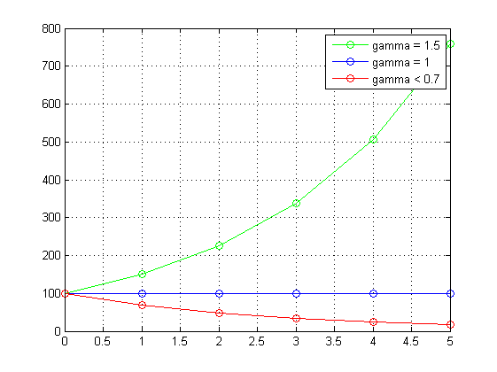

# 1. Этапы построения математической модели

## Модель народонаселения

*Англия, середина XVIII века. Церковь в глубинке.*

Прихожане — жители окрестных деревень. Приходский священник замечает, что число прихожан возросло и храм стал тесноват для богослужений. 

Священник размышляет: если число прихожан будет увеличиваться и дальше, придется строить новую церковь. Для этого понадобятся средства, и немалые. Срок, за который должен быть построен храм, и его размеры во многом зависят от того, как именно будет изменяться число окрестных жителей. Священник решает попытаться рассчитать это число.

\scriptsize

**Источник:** *Шикин Е.В., Чхартишвили А.Г.* Математические методы и модели в управлении. М.: Дело,	2004.

##

Изменение численности населения за n-й год
$$
\Delta x_n = x_{n+1} - x_n
$$

$x_n$ — численность населения в начале n-го года.

Подсчитывая число родившихся 
$$
b_1, b_2, \ldots, b_k
$$
и умерших 
$$
d_1, d_2, \ldots, d_k
$$
в разные годы, священник решает сопоставить полученные числа с общим числом прихожан за эти годы
$$
x_1, x_2, \ldots, x_k
$$

##

Священник замечает, что отношения
$$
\frac{b_1}{x_1}, \frac{b_2}{x_2}, \ldots, \frac{b_k}{x_k}
$$
и
$$
\frac{d_1}{x_1}, \frac{d_2}{x_2}, \ldots, \frac{d_k}{x_k}
$$
год от года почти не изменяются.

Для простоты расчетов можно считать эти отношения постоянными. Обозначим их через
$$
\alpha = \frac{b_i}{x_i}
$$
и
$$
\beta = \frac{d_i}{x_i}
$$

Изменение численности населения за год составляет разность между числом родившихся и числом умерших в этом году.

## Что мы сделали?

Мы сформулировали интересующие нас свойства реального объекта (население) на языке используемой нами отрасли науки (социологии, биологии). 

Полученную в результате модель будем называть **содержательной** или **вербальной** (от лат. *verbum* «слово»). 

При построении содержательной модели мы сформулировали гипотезы — допущения, при которых эта модель будет работать. В нашем примере это:

* темпы прироста и убыли населения остаются постоянными;
* миграция населения отсутствует;
* половая и возрастная структура населения остаются неизменными.

##

Число родившихся в n-м году оказывается равным
$$
\alpha x_n
$$
число умерших
$$
\beta x_n
$$
а изменение численности прихожан составит
$$
\Delta x_n = \alpha x_n - \beta x_n
$$
или
$$
x_{n+1}  = x_n + \alpha x_n - \beta x_n
$$
Обозначив $\gamma = 1 + \alpha - \beta$, получим в итоге **модель Мальтуса**

$$
x_{n+1}  = \gamma x_n
$$

## Принципы построения содержательной модели

<!-- Почему не рассмотрены другие допущения: способность к воспроизводству не зависит от возраста; в рассматриваемый период не происходит никаких катастроф (войн, эпидемий). -->

Бритва Оккама: "Не следует привлекать для объяснения новые сущности без крайней на то необходимости".

А.Эйнштейн: "Всё следует упрощать до тех пор, пока это возможно, но не более того".

Принцип KISS: "Keep it simple, stupid" ("Не усложняй").

## Этапы построения модели


\note{
На основе содержательной модели мы выписываем соответствующие уравнения или как-то иначе переводим модель на формальный математический язык, переходя тем самым к математической модели.
}

## Резюме

1. Процесс построения математической модели начинается с создания содержательной модели. 
2. В содержательной модели на словах описываются интересующие нас свойства объекта и принимаются оснонвые допущения.
3. Перечень допущений составляет неотъемлемую часть модели.
4. Содержательная модель формализуется в виде математической модели.
5. Решается математическая задача.

# 2. Работа с моделью

## Проанализируем модель народонаселения Мальтуса

$$
x_{n+1}  = \gamma x_n
$$

Возможны три случая:

1) $\gamma > 1$ ($\alpha - \beta > 0$ — рождается больше, чем умирает) — численность прихожан растет год от года;
2) $\gamma = 1$ ($\alpha - \beta = 0$ — умирает столько же, сколько рождается) — численность прихожан год от года остается неизменной;
3) $\gamma < 1$ ($\alpha - \beta < 0$ — умирает больше, чем рождается) — численность прихожан неуклонно снижается.

**Насколько быстро растет население в первом случае?**

\note{
Пример экспоненциального роста: задача об изобретении шахмат.
}

## Три случая изменения численности населения



## В чем проблема?

* Чтобы узнать численность населения в год $N$ нужно выполнит расчет населения в годы $N-1$, $N-2$, $N-3$, ..., начиная с самого начала.
* Расчеты выполняются с фиксированным интервалом — 1 год.
* По виду формулы трудно судить о закономерностях изменения численности населения.

## Переход к дифференциальному уравнению

Изменение численности населения за 1 год:
$$
x_{n+1} - x_n  = \delta \cdot x_n \qquad (= \alpha x_n - \beta x_n, \delta = \alpha - \beta)
$$
За малый промежуток времени $\Delta t$:
$$
x(t+\Delta t) - x(t)  = \delta \cdot x(t) \Delta t
$$
Разделим на $\Delta t$ и устремив $\Delta t \rightarrow 0$, получим:
$$
\frac{dx}{dt} = \delta \cdot x, \quad \delta - const
$$
— обыкновенное дифференциальное уравнение (ОДУ), выражающее закон Мальтуса.

**Обыкновенное** — потому что содержит производную $d/dt$, а не частную производную $\partial/\partial t$.

##

$x = f(t)$ — неизвестная функция, выражающая закон изменения численности населения во времени.

Нам известно, что скорость изменения численности населения $dx/dt$ пропорциональна самой этой численности $x$.

Аналитическое решение дифференциального уравнения Мальтуса имеет вид
$$
x = C e^{\delta t}
$$

**В чем смысл постоянной $C$?**

Теперь, задавшись численностью населения в начальный момент времени, можно вычислить ее в любой последующий момент времени.

## Символьные решения в Matlab

```
%% dx/dt = ax
syms a x
eqn = 'Dx = a*x';
dsolve(eqn,'t')

      C2*exp(a*t)

%% dx/dt = ax, x(0) = b
syms a x b
eqn = 'Dx = a*x';
cond = 'x(0)=b';
xSol = dsolve(eqn,cond,'t');

      b*exp(a*t)
```

\footnotesize

**Источник:** https://www.mathworks.com/help/symbolic/dsolve.html

## Резюме

* Аналитическое решение дает формулу, с помощью которой можно, задавшись значением в начальный момент времени, получить значение решения в любой последующий момент времени.
* Знание аналитического решения дает экономию усилий и ресурсов, направленных на расчеты.
* Далеко не все дифференциальные уравнения имеют аналитические решения.


# 3. Этапы работы с моделью

## От модели к проверке полученных результатов


## Терминология

**Верификация** (от лат. verus — истинный, facere — делать) — подтверждение соответствия модели (программного продукта) заданным требованиям.

Верификация подтверждает, что модель работает так, как и было задумано.

**Валидация** — проверка соответствия результатов моделирования результатам наблюдений за реальным объектом.

Валидация подтверждает, что мы создали адекватную («правильную») модель.

**Калибровка** модели — процесс определения и настройки параметров модели таким образом, чтобы обеспечить максимальное приближение результатов расчета к данным натурных измерений.

## Вернемся к модели Мальтуса

Калибровка модели состоит в определении $\gamma$ по данным наблюдений.

Результаты валидации модели Мальтуса: при расчете на 3—4 года вперед формула $x_{n+1}  = \gamma x_n$, ($\gamma > 1$) работает достаточно хорошо. Более долгосрочный прогноз, основанный на ней, оказывается ошибочным.

Теория Мальтуса пытается описать демографические процессы в доиндустриальных обществах.

## Закон Мальтуса

**Т. Р. Мальтус, "Principles of political economy considered with a view to their practical application" (1820 г.)**

Население имеет тенденцию размножаться по закону геометрической прогрессии:
$$
x_{n+1}  = \gamma x_n, \quad \gamma > 1
$$
в то время как средства существования могут увеличиваться лишь по закону арифметической прогрессии:
$$
y_{n+1} = y_n + d, \quad d > 0.
$$

### Выводы Мальтуса

Рост народонаселения может быть остановлен лишь встречными причинами, которые сводятся к нравственному воздержанию или несчастьям (войны, эпидемии, голод).

## Мальтузианская ловушка


## Дополняем модель Мальтуса

Полемика вокруг выводов Мальтуса была весьма острой. 

### Аргументы Чарльза Дарвина

Поскольку ни одна популяция не размножается до бесконечности, должны существовать факторы, препятствующие неограниченному размножению. 

Этими факторами могут быть:

* нехватка ресурса (продовольствия), вызывающая конкуренцию внутри популяции за ресурс,
* хищничество,
* конкуренция с другими видами. 

Результатом является замедление скорости роста популяции и выход ее численности на стационарный уровень.

## Модель Ферхюльста

С ростом $х$ конкурентная борьба за средства существования приводит к уменьшению $\delta$. Формализуем это
$$
\frac{dx}{dt} = \delta(x) \cdot x, \quad \delta(x) = a - bx
$$
Получим
$$
\frac{dx}{dt} = ax - bx^2
$$
или
$$
\frac{dx}{dt} = rx\left({1-\frac{x}{K}}\right)
$$

* $r$ характеризует скорость роста (размножения);
* $K$ — емкость среды (максимально возможная численность популяции). 

В экологии различают две стратегии поведения видов:

1. $r$-стратегия предполагает бурное размножение и короткую продолжительность жизни особей;
2. $K$-стратегия — низкий темп размножения и долгая жизнь.

## Логистическая кривая

$$
f(x) = \frac{1}{1+e^{-x}}
$$


## Закон Ферхюльста

$$
\frac{dp}{dt} = rp\left( 1-\frac{p}{K}\right), \quad p(0)=p_0
$$

$K=100$, $r=0.3$, $p_0=10$;

```
% Ищем аналитическое решение
eqn  = 'Dp = r*p*(1-p/K)';
init = 'p(0)=p0';
p = dsolve(eqn,init,'t')

% Строим график
K = 100; r = 0.3; p0 = 10;
t = linspace(0,30,100);
p = eval(vectorize(p));
plot(t,p), grid on;
```


## И снова логистическая кривая


## Немного магии...

```
p = K/(exp(K*(log((K - p0)/p0)/K - (r*t)/K)) + 1)
 
>> p = simplify(p)
 
p = (K*p0*exp(r*t))/(K - p0 + p0*exp(r*t))

```


## Проверка

Подставим найденное решение в исходное уравнение.

\small

```
syms K r t
z = diff(p,t) - r*p*(1-p/K)

z = (K*p0*r*exp(r*t))/(K - p0 + p0*exp(r*t)) - 
(K*p0^2*r*exp(2*r*t))/(K - p0 + p0*exp(r*t))^2 +
(K*p0*r*exp(r*t)*((p0*exp(r*t))/(K - p0 + p0*exp(r*t)) - 1))/(K - p0 + p0*exp(r*t))
 
simplify(z)
 
z = 0
```

## Пример: колебания груза на пружине


* сила трения отсутствует;
* масса точечная, т.е. нас не интересуют ее размеры;
* сила упругости подчиняется закону Гука: $F=-kx$.

## Строим математическую модель

<!-- В инерциальных системах отсчёта произведение массы материальной точки на приобретаемое ей ускорение пропорционально силе, действующей на точку. -->

Согласно 2-му закону Ньютона:

$$
m\frac{d^2 x}{d t^2} = -kx ,
$$
$$
m\frac{d^2 x}{d t^2} + kx = 0 .
$$
Это уравнение имеет аналитическое решение
$$
x = C_1\cos\sqrt{\frac{k}{m}}t + C_2\sin\sqrt{\frac{k}{m}}t
$$
$C_1$, $C_2$ — произвольные постоянные, определяемые из начальных условий.

Груз совершает гармонические колебания с центром $x=0$, с произвольной амплитудой и с угловой частотой $\omega_0 = \sqrt{k/m}$. 

## Колебания маятника без трения при $x(0)=\pi/4, x'(0)=0$


## Сводка функций

* `syms` объявляет символьный объект (класс sym);
* относительно символьных объектов можно делать предположения (`real`, `positive`);
* `diff` задает производную от переменной;
* `dsolve` аналитически решает ДУ.

## Задача

Найти аналитическое решение уравнения колебаний груза на пружине
$$
m\frac{d^2 x}{d t^2} + kx = 0 .
$$

1. при произвольных начальных условиях.
2. при начальных условиях: $x(0)=\pi/4, x'(0)=0$.

Вторая производная задается как: `diff(x,t,2)`. 

$x'(0)=0$ как `Dx = diff(x,t);`, а затем в начальных условиях: `Dx(0)==0`. 

## Решение

```
%% для старых версий MATLAB
syms x m k
cond = 'x(0)=pi/4, Dx(0)=0';
eqn = 'm*D2x + k*x = 0';
dsolve(eqn,cond,'t')

%% для новых версий MATLAB (>R2012b)
syms x(t) m k
Dx = diff(x,t);
cond = [x(0)==pi/4,Dx(0)==0];
eqn = m*diff(x,t,2) + k*x == 0;
dsolve(eqn,cond)
```


## Задача. Найти аналитическое решение дифференциального уравнения

$$
1 + \frac{dy}{dx} + y + x \frac{dy}{dx} = 0 .
$$

Построить график полученной функции $y = f(x,C)$ для нескольких значений произвольной постоянной $C$.


## Литература

* Мышкис А. Д. Элементы теории математических моделей: написание уравнений, упрощение уравнений, выбор решений. Изд. 3-е, испр. М.:	КомКнига, 2007. 192 с.

