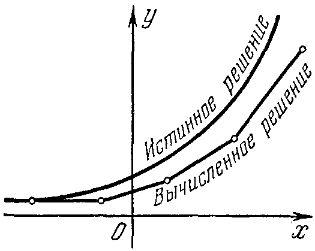
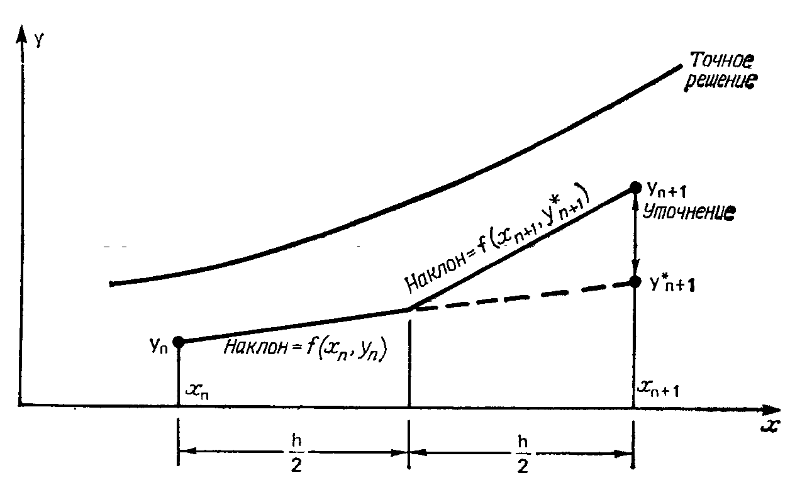
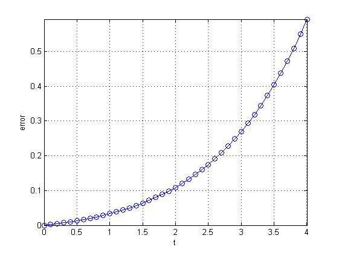

# 1. Метод Эйлера

## Численное решение

### Задача

Дано уравнение вида:
$$
\frac{dx}{dt} = f(x,t), 
$$
с начальным условием $x(t_0) = x_0$.

Нужно найти значения $x$ в моменты времени $T > t_0$
$$
x = F(t)  - ?
$$

## Проблема

* Далеко не каждое дифференциальное уравнение имеет аналитическое решение.
Для таких уравнений формулы вида $x=F(t)$ просто не существует.
* В этом случае уравнение решается численно.
* Численный метод — это алгоритм, позволяющий вычислить значение $x(T)$ при заданных начальных условиях. 
* Простейшим из численных методов является метод Эйлера.

## Метод Эйлера

Заменяем бесконечно малые интервалы $d$ на малые интервалы $\Delta$

\begin{equation}
\frac{dx}{dt} = f(x,t) \Rightarrow \frac{\Delta x}{\Delta t} \approx f(x,t).
\label{eq:preeuler}
\end{equation}

Разобьем промежуток $[t_0;t_N]$ на части длины $h$ (шаг)
$$
\Delta t = h - const .
$$

Разность $x$ в соседних точках разбиения составит
$$
\Delta x = x(t+h) - x(t) .
$$

Тогда из (\ref{eq:preeuler}) следует

\begin{equation}
x(t+h) - x(t) = h f(x,t) .
\label{eq:preeuler2}
\end{equation}


## Вспомним модель Мальтуса

Изменение численности населения на промежутке времени $\Delta t$:
$$
x(t + \Delta t) - x(t)  = \Delta t \cdot \delta \cdot x(t)
$$

Нам нужно вычислить $x(t + \Delta t)$, опираясь на известное значение  $x(t)$. Перенесем $x(t)$ в правую часть уравнения.


## Формула метода Эйлера

Тогда из (\ref{eq:preeuler2}) следует
$$
x(t+h) = x(t) + hf(x,t)
$$
— формула **метода Эйлера**.

Последовательность расчета:
$$
\begin{array}{ll}
x(t_1) &= x(t_0) + hf(x_0,t_0) \\
x(t_2) &= x(t_1) + hf(x_1,t_1) \\
\ldots & \ldots                \\
x(t_n) &= x(t_{n-1}) + hf(x_{n-1},t_{n-1}) \\
\end{array}
$$
$$
t_i = t_0 + ih , \quad i = 1, \ldots, N .
$$

## На каждом шаге в вычисления вносится локальная ошибка


## Накопление локальных ошибок на каждом шаге счета приводит к общей (глобальной) ошибке

<!--Общая ошибка — это разность между вычисленным и точным значением величины, определяющая суммарную погрешность, накопившуюся с момента начала вычислений.-->



##

На рисунке легко заметить недостаток метода Эйлера. Если верное решение загибается вверх, то кривая, которую мы вычисляем, всегда отходит вниз от этого решения, потому что для получения каждой следующей точки используется тангенс угла наклона касательной в предыдущей. С увеличением числа шагов, отклонение ломаной, полученной методом Эйлера от точной интегральной кривой будет возрастать.

## Причины появления погрешности

1. ошибка дискретизации, возникающая в результате замены дифференциального уравнения разностной аппроксимацией;
2. ошибка округления, накопившаяся при выполнении арифметических операций по формулам метода Эйлера (ограничения на представление чисел в используемом компьютере, погрешность аппроксимации функций).


## Точность метода Эйлера

Формула метода Эйлера
$$
x(t_i+h) = x(t_i) + hf(x_i,t) = x(t_i) + \frac{h}{1!}x'(t_i)
$$
является частью разложения функции $x(t)$ в ряд Тейлора в окрестности точки $t_i$
$$
x(t_i+h) = x(t_i) + \frac{h}{1!}x'(t_i) + \color{red}\frac{h^2}{2!}x''(t_i) + \ldots
$$
Локальная ошибка: $\frac{h^2}{2!}x''(t_i) \sim O(h^2)$.

Общая ошибка, накопившаяся за $n$ шагов расчета:
$$
\sum_{i=1}^n \frac{h^2}{2!}x''(t_i) \approx n \frac{h^2}{2!}x''(t^\ast) = 
\frac{nh}{2}x''(t^\ast)h = \frac{(T-t_0)}{2}x''(t^\ast)h \sim O(h)
$$
Общая ошибка метода Эйлера $\varepsilon \sim O(h)$ — этот метод является **методом 1-го порядка**.

## Численное решение методом Эйлера

```
h = .1;           % шаг интегрирования
t = 0; tStop = 4; % промежуток интегрирования [t;tStop]
x = 100;          % x(0)
a = .5;           
% dx/dt = f(x,t)
f = @(x,t) a*x;

tSol(1) = t; xSol(1) = x;
i = 1;
while t < tStop
    x = x + h*f(x,t);
    t = t + h;
    i = i + 1;
    tSol(i) = t;
    xSol(i) = x;
end
```

## Сравнение аналитического и численного решения для закона Мальтуса


## Первый шаг расчета по методу Эйлера


## Ошибка расчета


## Метод Эйлера для системы ДУ

$$
X'(t) = F(t,X), \qquad X(t_0) = X_0 ,
$$
где
$$
X = \left[{
\begin{array}{c}
x_1 \\
x_2 \\
\ldots \\
x_m
\end{array}
}\right] , \quad
X' = \left[{
\begin{array}{c}
x'_1 \\
x'_2 \\
\ldots \\
x'_m
\end{array}
}\right] , \quad
F(t,X) = \left[{
\begin{array}{c}
f_1(t,X) \\
f_2(t,X) \\
\ldots \\
f_m(t,X)
\end{array}
}\right] .
$$

Формула метода Эйлера:

$$
X_{k+1} = X_k + h F(t,X_k) .
$$

## Достоинства и недостатки метода Эйлера

Основное достоинство метода Эйлера — его простота. В реальных расчетах он практически не используется в силу:

1. большой погрешности вычислений ($O(h)$);
2. вычислительной неустойчивости.

## Модификация метода Эйлера

Точность метода Эйлера можно существенно повысить, улучшив аппроксимацию производной. 

Например, можно использовать среднее значение производной в начале и конце интервала.
$$
x_{k+1}^\ast = x_k + h f(x_k,t_k) ,
$$
$$
x_{k+1} = x_k + \frac{h}{2} \left[{f(x_k,t_k) + f(x_{k+1}^\ast,t_{k+1})}\right] .
$$

Общая ошибка модифицированного метода Эйлера: $O(h^2)$.

## Модифицированный метод Эйлера



## Изменения в коде

### Было

```
while t < tStop
    x = x + h*f(x,t);
    ...
end
```

### Стало

```
while t < tStop
    k1 = f(x,t);
    k2 = f(x+h*k1,t+h);
    x = x + (h/2)*(k1 + k2);
    ...
end
```

## Сравниваем аналитическое и численное решения


## Величина погрешности



## Вычислительная неустойчивость метода Эйлера


## Задача. 

Найдите решение уравнения

$$
\frac{dx}{dt}= 2t^2+2x, \quad x(0) = 1 .
$$ 
аналитически и с помощью метода Эйлера.

Подберите шаг $h$ так, чтобы разность между аналитическим и численным решениями в точке $x(1)$ составляла не более 1\%. 

Чему равна эта величина шага?


# 2. Решатели ОДУ в Matlab

## Пример

Найдем численное решение ОДУ
$$
x''+2x'+10x=\sin t.
$$

Начальные условия: $x(0)=1$, $x'(0)=0$.

Можно считать, что уравнение описывает колебания материальной точки под действием периодической внешней силы с учетом сопротивления среды. Координата точки в начальный момент времени равняется 1, а скорость — 0. 

## Схема решения в MATLAB

1. Приведение дифференциального уравнения $f(t,x,x',x'',x^{(n)}) = 0$ к системе дифференциальных уравнений первого порядка $Y'=F(t,Y)$.
2. Написание m-функции для правой части системы уравнений $F(t,Y)$.
3. Вызов подходящего решателя.
4. Визуализация результата.

## Приведем уравнение к системе уравнений 1-го порядка

$$
x'' + 2x' + 10x=\sin t.
$$

Делаем замену
$$
y = x' .
$$

Получаем
$$
\begin{array}{l}
y = x' , \\
y' + 2y + 10x=\sin t.
\end{array}
$$

Переносим производные в левую часть равенств, а члены без производных -- в правую
$$
\begin{array}{l}
x' = y, \\
y' = - 2y - 10x + \sin t.
\end{array}
$$
Делаем замену переменных
$$
\begin{array}{l}
x = y_1, \\
y = y_2.
\end{array}
$$


##

Получаем:
$$
\left[{
\begin{array}{c}
y'_1 \\
y'_2
\end{array}
}\right]
=
\left[{
\begin{array}{c}
y_2 \\
-2y_2-10y_1+\sin t
\end{array}
}\right] .
$$
Вектор начальных условий:
$$
Y(0) = 
\left[{
\begin{array}{c}
y_1(0) \\
y_2(0)
\end{array}
}\right]
=
\left[{
\begin{array}{c}
1 \\
0
\end{array}
}\right] .
$$

Вместо одного уравнения 2-го порядка получили 2 уравнения 1-го порядка.

В общем случае ОДУ $n$-го порядка сводится к системе $n$ уравнений 1-го порядка.

## Решатели (солверы)

Для решения задачи Коши в MATLAB существует семь решателей:

`ode45`, `ode23`, `ode113`, `ode15s`, `ode23s`, `ode23t` и `ode23tb`.

Вызов решателя:

```
[t,y] = solver(@fun,interval,y0,options)
```

Входные параметры:

*	`fun` — функция в которой вычисляется правая части системы ДУ — $F(t,Y)$;
*	`interval = [t0 tn]` — массив из двух чисел, задающий промежуток для решения уравнения;
*	`y0` — матрица-столбец начальных условий;
*	`options` — настройки для управления параметрами и ходом вычислительного процесса.

## Решатели (солверы) — 2

Выходные параметры:

*	массив `t` с координатами узлов сетки, в которых найдено решение;
*	матрицу решений `y`, каждый столбец которой является значением $Y_k$.

## m-функция для правой части системы уравнений $F(t,Y)$

```
% файл func.m
function F = func(t, y)
F = [y(2); -2*y(2) - 10*y(1) + sin(t)];
```

## Вызов решателя

Рекомендуется начинать с `ode45` — он подходит для большинства случаев.

## Код

```
% cформируем вектор начальных условий
y0 = [1; 0];
% зададим интервал исследования
dT = [0 15];
% воспользуемся решателем ode45
[T, Y] = ode45(@func, dT, y0);
% выведем график решения исходного ДУ - x(t)
% (маркеры - точки, линия - сплошная)
plot(T, Y(:, 1), '.-'), grid on;
```

## Визуализация


## Ссылки

1. Вержбицкий В. М. Основы численных методов, М.: Высшая школа, 2002. 840 с.
2. Плохотников К. Э. Вычислительные методы. Теория и практика в среде MATLAB: курс лекций. 2-е изд., испр. М.: Горячая линия – Телеком, 2013. 496 с.
3. Kiusalaas J. Numerical Methods in Engineering with MATLAB, 2nd ed., Cambridge University Press, 2009, 431 p.
