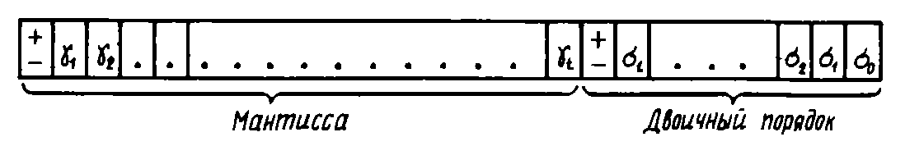
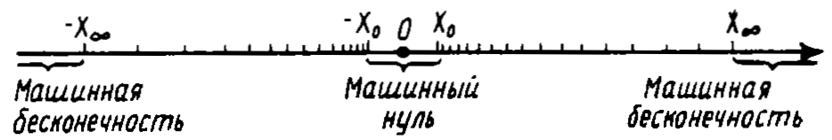
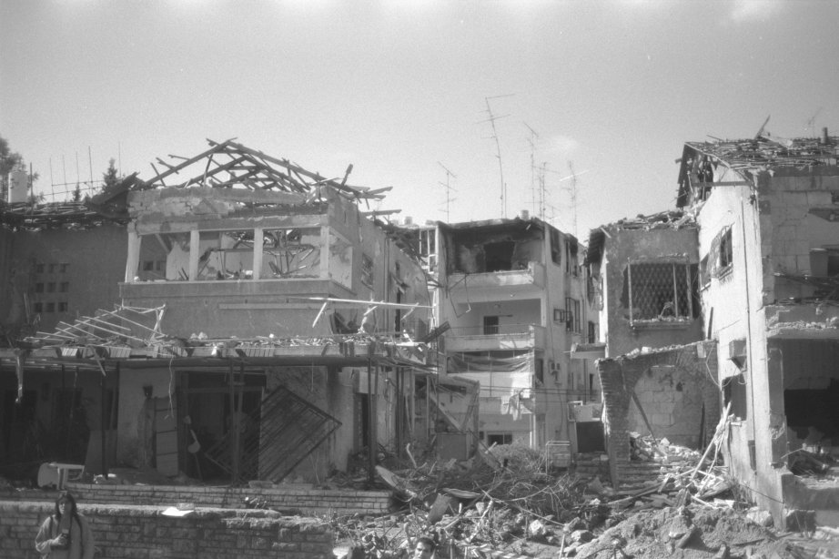
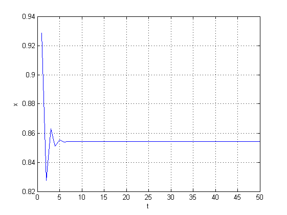
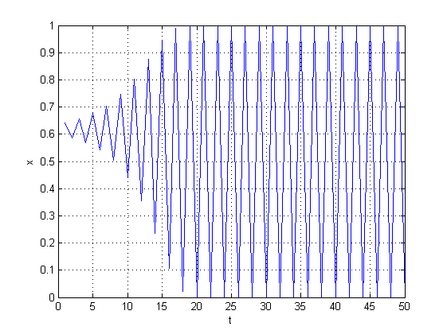
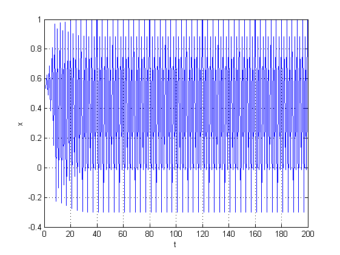
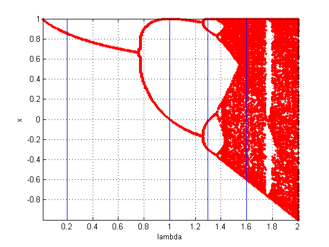
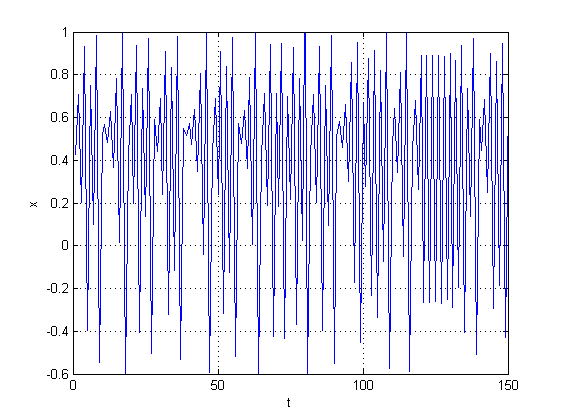

# 1. Особенности машинной арифметики

## Сложение

Попробуем вычесть на компьютере числа $10^{16}+1$ и $10^{16}$:

```
10^16 + 1 - 10^16 = 0
10^16 - 10^16 + 1 = 1
```

Т.е. сложение/вычитание чисел на компьютере **может оказаться некоммутативным**.

Поскольку это происходит с арифметическими действиями, то и результат вычисления функции на компьютере отличается от принятого в математике:

$\cos\pi/2=0$, a `cos(pi/2) = 6.1232е-17`.

## Предел

Второй замечательный предел:
$$
\lim_{{x\to \infty }}\left(1+{\frac {1}{x}}\right)^{x}=e \approx 2.718...
$$

Пробуем:

```
n = [1 1e3 1e7 1.2e11 1.2e13 1.7e14 1e15 3e15 5e15 8e15
     1e16 1e19];
(1+1./n).^n
```

Получаем:

```
[2.0000, 2.7169, 2.7183, 2.7183, 2.7161, 2.6683, 3.0350, 
 3.7896, 3.0350, 5.9083, 1.0000, 1.0000]
```

**Источник проблем лежит в несовпадении машинной арифметики с обычной из-за конечности разрядной сетки ЭВМ.**

## Представление вещественных чисел в памяти компьютера

Для хранения вещественного числа в памяти компьютера отводится поле стандартной длины — *машинное слово*. 

64-разрядный компьютер имеет машинного слова длиной 64 бита.

Вещественные числа представляется в памяти компьютера в форме записи с плавающей точкой.



## 

$1045.86$ => $0.104586 \cdot 10^4$ => `+104586+4`

* `104586` – мантисса числа (цифры после запятой)
* `4` – порядок (показатель степени).

Пусть длина машинного слова равна 9, длина мантиссы m=6, порядка p=1. 

Если мантисса имеет меньший порядок, то наше число будет обрезано, чтобы уместится в заданное число разрядов.

При m=4 получим: `+1045+4` => $0.1046\cdot10^4$.

Из такого представления чисел вытекает ряд следствий...


## Следствие 1. В компьютере представимы не все числа

...а лишь конечное подмножество рациональных чисел, «укладывающееся» в рамки машинного слова

Любое другое число будет представлено с ошибкой округления, не меньшей единицы младшего разряда мантиссы.

<!--Какая точность вычислений была в примере выше при m=6?-->

**Машинный эпсилон** (машинная точность) $\varepsilon_M$ — наименьшее представимое в компьютере число, удовлетворяющее условию
$$
\varepsilon_M = \min \{ \varepsilon : 1+\varepsilon > 1 \}
$$

$\varepsilon_M$ характеризует наименьшую относительную погрешность вычислений и зависит от конкретной ЭВМ и разрядности вычислений (`single`, `double`, ...). Требовать большего невозможно!

```
eps = 1;
x = 1;
while x + eps > x, eps = eps/2, end
```


## Следствие 2. Диапазон изменения чисел в компьютере ограничен

Существует минимальное $X_{min}$ и максимальное $X_{max}$ числа, которые можно представить в данном компе. Все числа, меньшие по модуля $X_{min}$ для машины не различимы и представляют собой машинный нуль. Числа же большие Xmax рассматриваются как машинная бесконечность (`Inf`).

Пусть $10^{-78} \leq |x| \geq 10^{76}$ (одинарная точность).

Вычислим `x = ab/(cd)` при `a = 10^(-30)`, `b = 10^(-35)`, `c = 10^(-40)`, `d = 10^(-25)`

*	`x = a*b/c/d` => underflow; 
* `x = 1/c/d*a*b` => overflow.
*	`x = a/c * b/d`  => `х = 1` (правильный ответ). Этот же ответ можно получить, если отмасштабировать переменные, например, умножив на `10^40`.

**При переполнении или исчезновении порядка нужно попытаться изменить последовательность действий или ввести масштабные множители.**


## Следствие 3. На машинной числовой прямой числа распределены неравномерно

Плотность чисел возрастает по мере приближения к нулю и убывает по мере отдаления. 

$\varepsilon_M$ зависит от разрядности мантиссы, но ведь есть еще и порядок! Из-за различия в последнем знаке мантиссы 1.001e0 и 1e0 отличаются на 0.001, но если увеличить порядок, то 1.001e3 и 1e3 будут отличаться на 1.000.

**При сложении (умножении) следует располагать слагаемые так, чтобы при каждом сложении порядки величин различались мало.**




## ПРК "Пэтриот", 25.02.1991 — ошибка при перехвате иракских ракет

\small

Время измерялось системными часами в десятках секунд, а затем умножалось на 1/10 чтобы получить результат в секундах. Вычисление производились с 24-разрядными числами. 

1/10 — бесконечная двоичная дробь, которая обрезалась после 24-го разряда. Появлялась ошибка округления, из-за которой батарея противоракет, находившаяся на боевом дежурстве около 100 часов, накапливала погрешность в определении времени в 0.34 с.

Ракета "Scud" (Р-17) летит со скоростью около 1676 м/с и за 0.34 с. пролетает около 0.5 километра. В итоге система ПРО не реагировала на подлетающую ракету, считая что та находится за пределами охраняемого участка.

\scriptsize

**Источник:** http://www-users.math.umn.edu/~arnold/disasters/patriot.html

## Проверим?

Что будет, если сравнить

```
0.3 == 0.3
```

А это?

```
0.4 - 0.1 == 0.3
```

## Что подлетало: Р-17


## Куда прилетело



## Ариан-5, 4.06.1996 — взрыв после 40 секунд полета

The rocket was on its first voyage, after a decade of development costing \$7 billion. The destroyed rocket and its cargo were valued at \$500 million. The cause of the failure was a software error in the inertial reference system. Specifically a 64 bit floating point number relating to the horizontal velocity of the rocket with respect to the platform was converted to a 16 bit signed integer. The number was larger than 32768, the largest integer storeable in a 16 bit signed integer, and thus the conversion failed.

\scriptsize

**Источник:** http://www-users.math.umn.edu/~arnold/disasters/ariane.html


# 2. Приближенные вычисления

## Абсолютная и относительная погрешности

* $a$ — точное значение, вообще говоря, неизвестное;
* $a^\ast$ — известное приближенное значение.

**Абсолютная погрешность**  (absolute tolerance)
$$
\Delta (a^\ast) = |a-a^\ast| .
$$ 

Чтобы охарактеризовать точность, абсолютной погрешности недостаточно. Погрешность нужно сопоставлять со значением измеряемой величины.

<!--Погрешность определения температуры в 10 градусов — это много или мало? При измерении температуры тела или Солнца-->

**Относительная погрешность** (relative tolerance)
$$
\delta (a^\ast) = \frac{|a-a^\ast|}{|a|} .
$$

Относительная погрешность не зависит от масштабов и единиц измерения. Ее удобно определять в процентах.

На практике точное значение числа неизвестно и вместо самих погрешностей оперируют их оценками.

## Погрешность вычисления разности

Погрешности вычислительных методов образуются из погрешностей выполнения арифметических операций.
$$
\Delta (a^\ast - b^\ast) = |(a-a^\ast) - (b-b^\ast)| \leq |a-a^\ast| + |b-b^\ast| = \Delta (a^\ast) + \Delta(b^\ast)
$$
Найдем относительную погрешность $a - b$ при условии, что $a$ и $b$ одного знака
$$
|a-b|\delta (a^\ast - b^\ast) \leq |a|\delta (a^\ast) + |b|\delta(b^\ast) \leq (|a|+|b|)\delta_{max} = |a+b|\delta_{max}
$$
$$
\delta (a^\ast - b^\ast) \leq \frac{|a+b|}{|a-b|}\delta_{max}
$$
При $a \approx b$: $\delta (a^\ast - b^\ast) \rightarrow \infty$.

Происходит катастрофическая потеря точности.

## Пример

$$
\delta (a^\ast - b^\ast) \leq \frac{\Delta (a^\ast + b^\ast)}{|a-b|}
$$

$a^\ast = 47.132\pm0.0005$ и $b^\ast = 47.111\pm0.0005$. Вычислим $\delta (a^\ast - b^\ast)$.

1. $\Delta (a^\ast + b^\ast) = 0.0005+0.0005 = 0.001$
2. $a-b = 0.021$
3. $\delta (a^\ast - b^\ast) = 0.001/0.021 \approx 0.05$

$\delta (a^\ast - b^\ast)$ **в 5000 раз больше** относительных погрешностей исходных данных ($\delta (a^\ast) = 0.0005/47.132 \approx 0.00001$, $\delta (b^\ast) \approx 0.00001$).

**Следует избегать вычитания близких чисел. Если это невозможно, нужно использовать для вычитаемых чисел типы данных с большей точностью.**

# 3. Суммируем погрешности

## Неустранимые погрешности

Погрешности появляются на каждом этапе работы

**1. Математическая модель** — всегда идеализированное, приближенное описание задачи. Неучтенные в ней факторы являются источником неточностей.

**2. Исходные данные** получены либо помощью измерений, либо с помощью других моделей. И те и другие содержат погрешности.

Погрешности модели и исходных данных характерны для любых расчетов. Это **неустранимые погрешности**, поскольку их нельзя убрать или уменьшить в ходе вычислений.

## Погрешности вычислений

**3.** Решением задачи является **вычислительный алгоритм**. Он дает приближенное решение задачи и обладает погрешностями, называемыми погрешности метода. 

**4. Погрешности округления** связаны с представлением чисел на компьютере. Например, на компьютере нельзя представить иррациональное число. Разница между округленным числом и исходным и есть погрешность округления.

## Резюме

* Основы точности расчетов закладываются на этапе выбора математической модели. Исходя из этого, выбираются численные методы и программные средства.
* Во время вычислений нашей целью является — не испортить точность, заложенную в модели и исходных данных.
* Цель вычислений состоит в том, чтобы получить результат с заданной точностью. 

# 4. Логистическое отображение

## Математическая формулировка

Логистическое отображение — дискретный аналог уравнения Ферхюльста.

$$
x_{n+1}=rx_{n}(1-x_{n})
$$
где:

* $x_{n}$ принимает значения от 0 до 1 и отражает численность популяции в $n$-ом году, а $x_{0}$ обозначает начальную численность (в год номер 0);
* $r$ — положительный параметр, характеризующий скорость размножения популяции.

Эквивалентная формула:
$$
x_{{n+1}}=1-\lambda x_{n}^{2}.
$$
Будем изменять $\lambda$ в пределах $(0;2]$ и проследим за изменениями численности популяции.

## $\lambda=0.2$



## $\lambda=1$



## $\lambda=1.3$



## Карта



## $\lambda=1.6$ — детерминированный хаос



## Ссылки

1. Вержбицкий В. М. Основы численных методов, М.: Высшая школа, 2002. 840 с.
