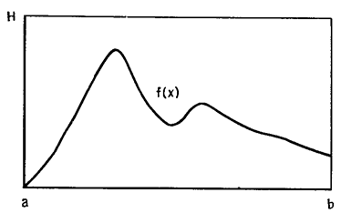
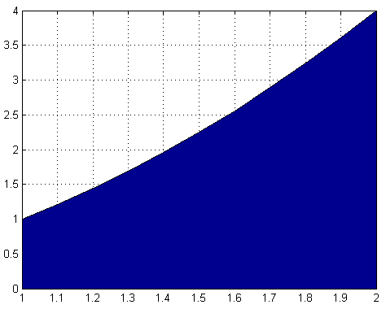
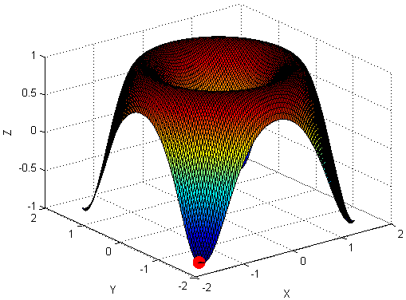
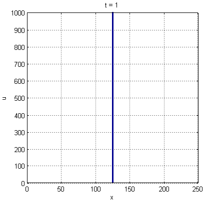
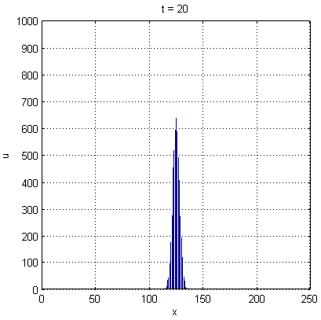
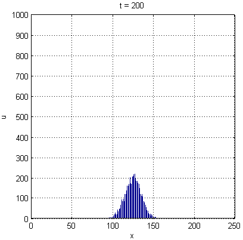
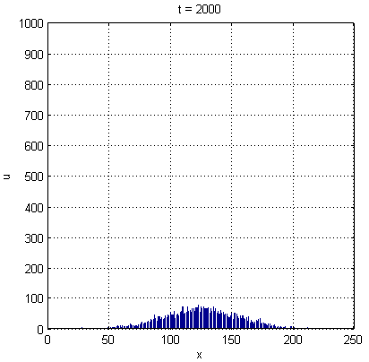
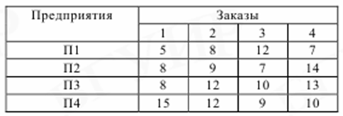
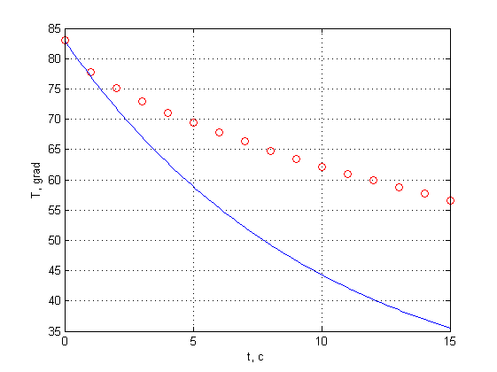
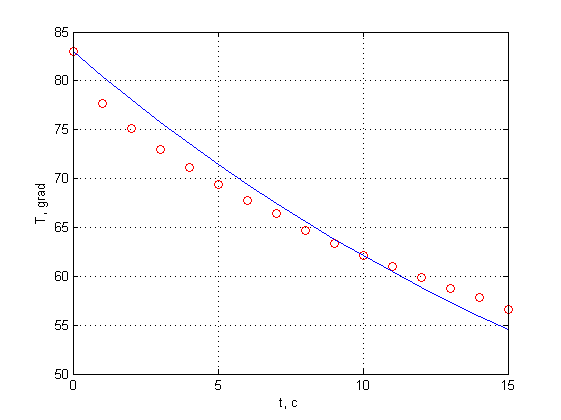

# 1. Метод Монте-Карло

##

Идею предложил Станислав Улам в конце 1940-х гг.

Метод формулируется в виде условия, которое либо выполняется либо нет. 

Проверка выполнения условия называется *испытанием*. Условие проверяется на объектах, задаваемых случайным образом. Поэтому метод еще называют **методом статистических испытаний**.

Без появления компьютера был бы невозможен.

Для реализации необходим генератор (псевдо)случайных чисел.


## Генератор случайных чисел

Алгоритм, генерирующий последовательность чисел, которая выглядеть как случайная.

Первый алгоритм предложен Джоном фон Нейманом и называется *методом середины квадратов*.

1. $n_1$ = 9876
2. $n_1^2$ = 97**5353**76
3. $n_2$ = 5353
4. $n_2^2$ = 28**6546**09
5. $n_3$ = 6546
6. ...

Метод простой, но плохой: последовательность чисел быстро зацикливается.

## Численное интегрирование



##

$$
F(x) = \int_a^b f(x) dx
$$

* $A = H(b-a)$ — площадь прямоугольника;
* $n$ — число испытаний;
* $n_s$ — число точек, лежащих под кривой $y=f(x)$.

### Алгоритм

1. Генерируем $n$ пар случайных чисел $(x_i,y_i)$: $a \leq x_i \leq b$, $0 \leq y_i \leq H$.
2. Для каждой пары $(x_i,y_i)$ проверяем условие $y_i \leq f(x_i)$ и подсчитываем число удовлетворяющих ему пар $n_s$.

Формула для вычисления интеграла:

$$
F(x) = A\frac{n_s}{n} .
$$

## Пример вычисления интеграла

\Large

Вычислить интеграл
$$
F(x) = \int_1^2 x^2 dx
$$
с точностью 0.01.

Для проверки использовать точное значение интеграла.


## Код

```
n = 1e6;
% Генерируем точки, попадающие в прямоугольник [1,2;0,4]
x = 1 + rand(1,n);
y = 4*rand(1,n);
% Вычислим значения функции для случайных x
f = x.^2;
% Подсчитаем число попаданий под кривую f(x)=x^2
ns = sum(y <= f);
% Вычислим площадь как долю площади прямоугольника
area_rect = (2-1)*(4-0);
area = ns/n*area_rect
```


## Вычисление точного значения интеграла

```
% Вариант 1
F = int(sym('x^2'),1,2)
% Вариант 2
syms x
F = int(x^2,1,2)

  7/3
```


## Проверка

```
area = 2.3369 % У вас будет другое значение
abs(area - 7/3) = 0.0035
```

Уменьшение значений `n` показало, что уже при `n = 1e4` точность становится лучше требуемой `0.01`.


## Как выбрать размеры объемлющей фигуры




## Вычисление $\pi$

\bcols
\column{.5\textwidth}

\column{.5\textwidth}

\ecols
$$
\frac{n_s}{n} \approx \frac{S_{circle}}{S_{square}} = \frac{\pi r^2}{a^2} \Rightarrow 
\pi \approx 4\frac{n_s}{n}
$$
$a = 2r$ — длина стороны квадрата.

## Код

\Large

```
n = 1e6;
x = rand(1,n);
fun = sqrt(1-x.^2);
y = rand(1,n);
% счетчик попаданий внутрь окружности
ns = sum(y <= fun);
pi_ = 4*ns/n
```

## Задача

\Large

Вычислить интеграл
$$
F(x) = \int_\frac{\pi}{4}^\frac{\pi}{2} \frac{\cos x}{x} dx
$$
с точностью 0.01.

Для проверки используйте точное значение, полученное по формуле

```
eval(int(sym('cos(x)/x'),pi/4,pi/2))
```


## Вычисление экстремумов

\bcols
\column{.5\textwidth}
$$
z = \sin(x^2 +y^2), \quad \argmin(z) - ?
$$
\column{.5\textwidth}

\ecols

```
rng(123); % зерно генератора СЧ
n = 1e5;
x = -pi/2+pi*rand(1,n);
y = -pi/2+pi*rand(1,n);
z = sin(x.^2 + y.^2);
z_min = min(z);
i = find(z == z_min);
>> x_min = -1.556780, y_min = -1.512477, z_min = -0.999999
```

## Моделирование диффузии

Диффузия — процесс переноса вещества из области с высокой концентрацией в область с низкой концентрацией.


\scriptsize

**Источник:** http://www.visionlearning.com/en/library/Chemistry/1/Diffusion-I/216

## Одномерный случай: диффузия в направлении оси х

Возможны два подхода к представлению вещества:

1. Сплошная среда с плотностью $u=u(x,t)$.
2. Множество частиц.

\begin{center}
\includegraphics[width=185pt]{images/density.png}
\end{center}

## Идея решения

Создадим массив точек (частиц).

На каждом шаге частица может двигаться вправо, влево или остаться на месте.

Через некоторое время (количество шагов) частица удалится на некоторое расстояние от источника. 

Концентрацию частиц (количество частиц в единице объема) получим при помощи гистограммы.

*Внимание:* частицы — не молекулы, они гораздо крупнее.

## Изменение концентрации со временем

\bcols
\column{.5\textwidth}

\column{.5\textwidth}

\ecols

## Изменение концентрации со временем - 2

\bcols
\column{.5\textwidth}

\column{.5\textwidth}

\ecols

## Код

```
n = 250;             % число ячеек
m = 5000;            % число частиц
tmax = 200;          % время расчета

x = (n/2)*ones(1,m); % все частицы находятся в центре

dice = [-1,0,+1];    % варианты шагов

for k = 1:tmax
    dx = dice( round(1+2*rand(1,m)) );
    x = x + dx;
end
```

## Код: рисование

```
hist(x,m);
axis([0,n,0,m/5]); axis square; grid on;
title(['t = ', num2str(tmax)]);
xlabel('x'); ylabel('u');
```

## Развитие модели

* различные вероятности переходов, моделирующие течение или плотность среды; 
* разная длина скачка, чтобы получить решение для гетерогенной среды;
* наличие отражающих стенок;
* добавление и удаление (гибель или рождение) частиц.
* ...

## Задача о назначениях

Требуется  разместить  на  четырех предприятиях (П1, П2, П3, П4) заказы,  связанные  с  выполнением  четырех работ. Каждое предприятие  может  выполнить  любой  из  заказов,  но  только один. Требуется разместить заказы таким образом, чтобы общая стоимость их выполнения была минимальной.



## Код

```
n = 1000;           % число испытаний
num_ent = 4;        % число предприятий
num_ord = 4;        % число заказов

costs = zeros(1,n); % затраты на заказы
o = zeros(n,4);     % распределение заказов по предприятиям
ent = [5,8,12,7;
       8,9,7,14;
       8,12,10,13;
       15,12,9,10];
   
rng(123);
for i=1:n
  o(i,:) = randperm(num_ent,num_ord);
  costs(i) = ent(1,o(i,1)) + ent(2,o(i,2)) + ...
             ent(3,o(i,3)) + ent(4,o(i,4));
end

[costs_min,imin] = min(costs);
```

## Ответ

```
[costs_min,imin] = min(costs);
costs_min
orders_allocation = o(imin,:)
```

\large

Минимальные затраты на размещение заказа: 33.

Распределение заказов по предприятиям: П1 = 4, П2 = 2, П3 = 1, П4 = 3.

## Точность расчетов методом Монте-Карло

\large

Ошибка вычислений по методу Монте-Карло: $\sim \sqrt{d/N}$

* $d$ — некоторая константа
* $N$ — количество испытаний.

Для повышения точности в 10 раз необходимо увеличить количество испытаний в 100 раз.

## Резюме

* Метод Монте-Карло — универсальный и простой в реализации вычислительный прием.
* Требует высокой производительности расчетов.


# 2. Калибровка модели

##

\large

**Калибровка модели** — процесс определения и настройки параметров модели таким образом, чтобы обеспечить максимальное приближение результатов расчета к данным натурных измерений.

## Задача об остывании чашки кофе

Изменение температуры объекта $\Delta T$ за малый промежуток времени $\Delta t$ пропорционально разности температур объекта $T$ и среды $T_s$:
$$
\frac{\Delta T}{\Delta t} = -r(T-T_s) ,
$$
$r$ — коэффициент пропорциональности (остывания).

Если известны температура среды $T_s$ ($T_s - const$) и температура кофе в начальный момент времени $T_0 = T(t_0)$, то температура $T_1$ в момент времени $t_1 = t_0 + \Delta t$ равна
$$
T_1 = T_0 - r(T_0-T_s)\Delta t .
$$

У нас есть данные наблюдений за процессом остывания: температуры, записанные в определенные моменты времени. **Чему равен коэффициент $r$?**

## Загрузка экспериментальных данных

```
data = dlmread('tdata.txt',' ');
te = data(:,1);  % время
Te = data(:,2);  % температура

plot(te,Te,'ro'), grid on, hold on;
xlabel('t, c'); ylabel('T, grad');
```

## Пусть $r=0.1$



## Подбор $r$

Подберем значение $r$ так, чтобы расстояние между графиками было минимальным.

Величина ошибки (критерий близости):
$$
\varepsilon (r) = \sqrt{\sum_{i=1}^n \left({T_{exper}^i - T_{calc}^i (r)}\right)^2}
$$
Ошибка должна быть минимальной.

## Фрагмент кода с подбором $r$

```
while (err_max > 0.1) & (k < kmax)
    r = 0.1*rand;
    for i = 1:nstep
        T(i+1) = T(i) - r*(T(i)-Ts)*dt;
    end
    Tc = T(1:10:end)';
    err = sqrt( sum((Tc-Te).^2) );
    %err = sqrt( (Tc(end)-Te(end)).^2 );
    if err < err_max
        err_max = err;
        rbest = r;
        Tbest = Tc;
    end
    k = k + 1;
end
```

## Результат



## Ссылки

* Поршнев С. В. Компьютерное моделирование физических процессов в пакете MATLAB. 2-е изд., испр. СПб.: Издательство «Лань», 2011. 736 с.
