# 1. Метод наименьших квадратов (Ordinary Least Squares)


## Экспериментальные значения температуры кофе

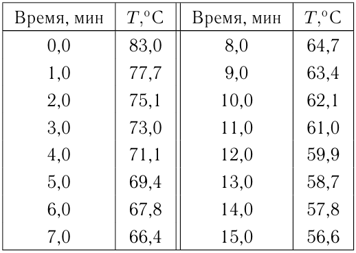


## Постановка задачи

Необходимо найти функцию заданного вида
$$
y = f(x)
$$
которая в точках $x_1, x_2, \ldots, x_n$ (моменты времени) принимает значения как можно более близкие к табличным $y_1, y_2, \ldots, y_n$ (температура).


## Какие функции используют

* $a_0 + a_1 x + a_2 x^2 + \ldots + a_2 x^n$
* $\sin(x)$, $\cos(x)$
* $\exp(x)$, $\log(x)$
* ...


## Метрика качества приближения

Приближающая функция $F(x)$ в точках $x_1, x_2, \ldots, x_n$ имеет значения:
$$
f_1, f_2, \ldots, f_n
$$
Расстояние между соответствующими точками таблицы и приближающей функции должно быть наименьшим:
$$
\sqrt{(y_1-f_1)^2 + (y_2-f_2)^2 + \ldots + (y_n-f_n)^2} \rightarrow \min
$$


Функция потерь (loss function):

$$
L(f_1, f_2, \ldots, f_n) = \sqrt{\sum_{i=1}^n (y_i-f_i)^2}
$$


## Линейная аппроксимация

$$
F(x) = a + bx
$$
Нужно подобрать $a$ и $b$ так, чтобы сумма квадратов отклонений точек $f_i$ от наблюдаемых значений $y_i$ была минимальной.
$$
L(a,b) = \sum_{i=1}^n (y_i - f(x_i,a,b))^2 \rightarrow \min
$$


## Экстремум функции

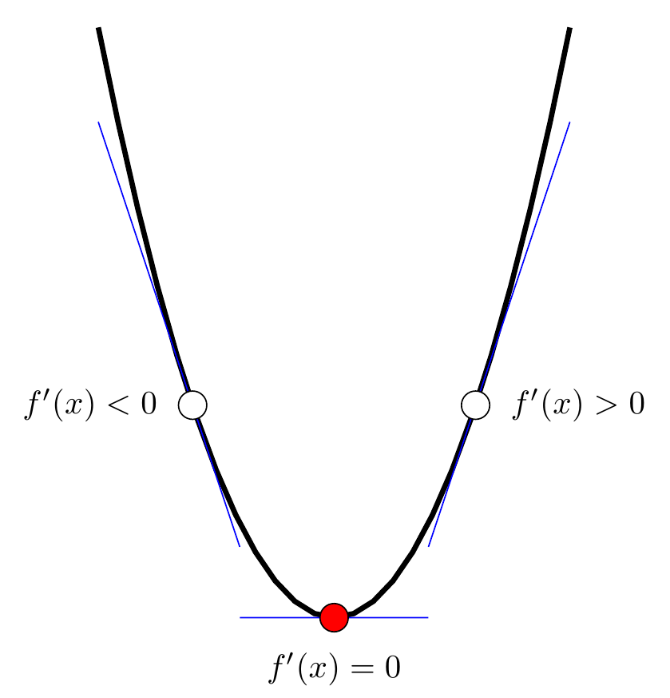


## Необходимое условие экстремума

$$
\frac{\partial L}{\partial a} = \frac{\partial L}{\partial b} = 0 .
$$

##

\footnotesize

Найдем значения $a$ и $b$, обращающие $L(a,b)$ в минимум
\begin{align*}
\frac{\partial L}{\partial a} &= \sum_{i=1}^n (y_i - (a + bx_i))\frac{\partial f}{\partial a} = 0, \\
\frac{\partial L}{\partial b} &= \sum_{i=1}^n (y_i - (a + bx_i))\frac{\partial f}{\partial b} = 0.
\end{align*}

Вычислим производные $f(x) = a + bx$
$$
\frac{\partial f}{\partial a} = 1, \quad
\frac{\partial f}{\partial b} = x.
$$
Получим
\begin{align*}
\sum_{i=1}^n (y_i - (a + bx_i)) &= 0, \\
\sum_{i=1}^n (y_i - (a + bx_i))x_i &= 0.
\end{align*}


##

\begin{align*}
\sum_{i=1}^n y_i - an - b\sum_{i=1}^n x_i &= 0, \\
\sum_{i=1}^n y_i x_i - a\sum_{i=1}^n x_i - b \sum_{i=1}^n x_i^2 &= 0.
\end{align*}

Разделим уравнения на $n$
\begin{align*}
 a + \left({\frac{1}{n}\sum_{i=1}^n x_i }\right) b &= \frac{1}{n}\sum_{i=1}^n y_i, \\
\left({\frac{1}{n}\sum_{i=1}^n x_i }\right) a + \left({\frac{1}{n}\sum_{i=1}^n x_i^2 }\right) b &= \frac{1}{n}\sum_{i=1}^n y_i x_i.
\end{align*}

##

Введем обозначения
$$
M_x = \frac{1}{n}\sum x_i , \quad M_y = \frac{1}{n}\sum y_i,
$$
$$
M_{x^2} = \frac{1}{n}\sum x_i^2 , \quad M_{xy} = \frac{1}{n}\sum_{i=1}^n y_i x_i
$$
Перепишем с их помощью систему уравнений
\begin{align*}
a + M_x \cdot b &= M_y, \\
M_x \cdot a + M_{x^2} \cdot b &= M_{xy}.
\end{align*}


## Та-даа-м!

$$
\left[{
\begin{array}{ll}
1 & M_x \\
M_x & M_{x^2}
\end{array}
}\right]
\left[{
\begin{array}{l}
a \\
b \\
\end{array}
}\right] = 
\left[{
\begin{array}{l}
M_y \\
M_{xy}
\end{array}
}\right]
$$

Получаем формулу для вычисления коэффициентов $a$ и $b$
$$
\left[{
\begin{array}{l}
a \\
b \\
\end{array}
}\right] =
{\left[{
\begin{array}{ll}
1 & M_x \\
M_x & M_{x^2}
\end{array}
}\right]}^{-1}
\left[{
\begin{array}{l}
M_y \\
M_{xy}
\end{array}
}\right]
$$


## Вернемся к аппроксимации температуры

Для приближения табличных данных будем использовать функцию вида
$$
f(x) = e^{a+bt}
$$
$$
\varphi(x) = \ln(f(x)) = a+bt
$$


## Код

```
x = 0:15; % задание моментов времени
y = [83, 77.7, 75.1, 73.0, 71.1, 69.4, ...
     67.8, 66.4, 64.7, 63.4, 62.1, ...
     61.0, 59.9, 58.7, 57.8, 56.6]; % задание температуры
n = length(x);
y1 = log(y);
% Вычисление элементов матрицы системы
Mx = sum(x)/n;
My = sum(y1)/n;
Mx2 = sum(x.^2)/n;
Mxy = x*y1'/n;
% Задание матрицы системы
M = [1 Mx; Mx Mx2];
% Задание столбца свободных членов системы
d = [My; Mxy];
% Решение системы линейных уравнений
s = M\d;
```


##

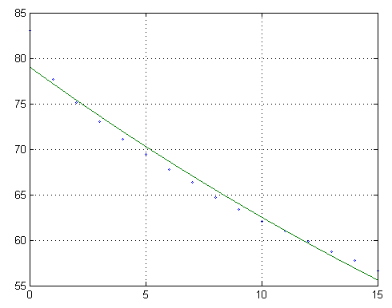


## Чему равна погрешность аппроксимации

```
% Задание дискретных значений независимой переменной
t = 0:0.01:x(n);
% Вычисление значений аппроксимирующей функции
T = exp( s(1)+s(2)*t );
% Визуализация исходных данных и аппроксимирующей функции
plot(x, y, 'o', t, T, 'MarkerSize', 2), grid on

% Вычисление функции потерь
f = exp( s(1)+s(2)*x );
err = sqrt(sum((y-f).^2));
```
```
>> err = 4.7362
```


# 2. Функции Matlab

##

\Large

* `polyfit` — вычисляет коэффициенты аппроксимирующего полинома n-й степени;
* `polyval` — вычисляет значения этого полинома в заданных точках.


## polyfit

```
p = polyfit(x, y, n)
```
Находит коэффициенты полинома $p(x)$ степени $n$
$$
p(x) = p_1 x^n + p_2 x^{n-1} + \ldots + p_n x + p_{n+1}
$$

который приближает функцию $y(x)$ методом наименьших квадратов. 

**Ввод:** `x`, `y` — табличные значения независимой переменной и функции, `n` — степень полинома.

**Вывод:** вектор `p` длины `n+1`, содержащий коэффициенты полинома $p(x)$.


## polyval

```
y = polyval(p, x)
```

**Ввод:** `p = [p1 p2 ... pn pn+1]` — вектор коэффициентов аппроксимирующего полинома, полученный с помощью `polyfit`,`x` — вектор значений независимой переменной, в которых нужно вычислить полином.

**Вывод:** `y` — вычисленные значения аппроксимирующего полинома.


## Задача

Экспериментальные данные

```
x = [1 2.2 2.4 2.7 3.1 3.5 4.5 5];
y = [9.054 15.077 15.754 18.3 17.984 15.852 1.772 -13.042];
```

Требуется:

* аппроксимировать кубическим многочленом;
* вычислить значения найденного многочлена на интервале от 0.9 до 5.5 с шагом 0.1;
* построить график многочлена и экспериментальных точек в общих координатных осях.


# 3. Прогнозирование

## Подгонка данных полиномом степени M

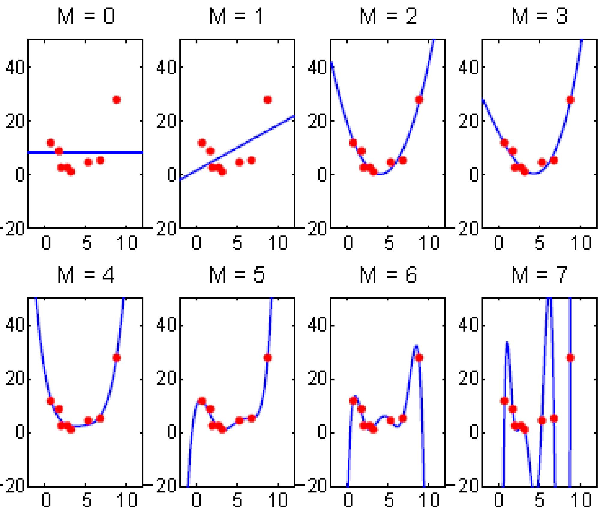


## Какая из моделей лучше?

Надо выбрать ту из моделей, которая наилучшим образом подгоняет данные.

То есть ту, у которой наименьшая средняя ошибка (или наименьшая средняя квадратичная ошибка).


## Зачем нужна модель?

Чтобы успешно предсказывать будущие наблюдения.

* то есть для **нового** значения x предсказать значение y с маленькой погрешностью.

Наилучшей будет та модель, которая лучше всех будет предсказывать, то есть описывать (подгонять) **новые** данные.

\large

Отличие прогнозирования (регрессии) от аппроксимации:

* Аппроксимация подгоняет имеющиеся данные, регрессия — новые данные.


## Переподгонка

**Overfitting** — чрезмерная подгонка или переобучение. Использование чрезмерно сложной модели для описания данных.

### Лирическое отступление

Портной научился хорошо шить костюмы для мистера Смита.

Пока он шьет для Смита — все идет хорошо.

Но если он будет шить для Джонса по мерке, снятой со Смита, результат может быть несколько хуже.

\note{
Лирическое отступление — пересказ из 9-й лекции курса В.Л. Аббакумова (https://compscicenter.ru/courses/data-mining-r-problems/2016-spring/)
}

## Проблема

* У нас нет будущих значений…

### Решение

* Так сделаем их из прошлых!
* Отберем часть наблюдений и объявим их "будущими".


## Выбор наилучшего полинома для регрессии

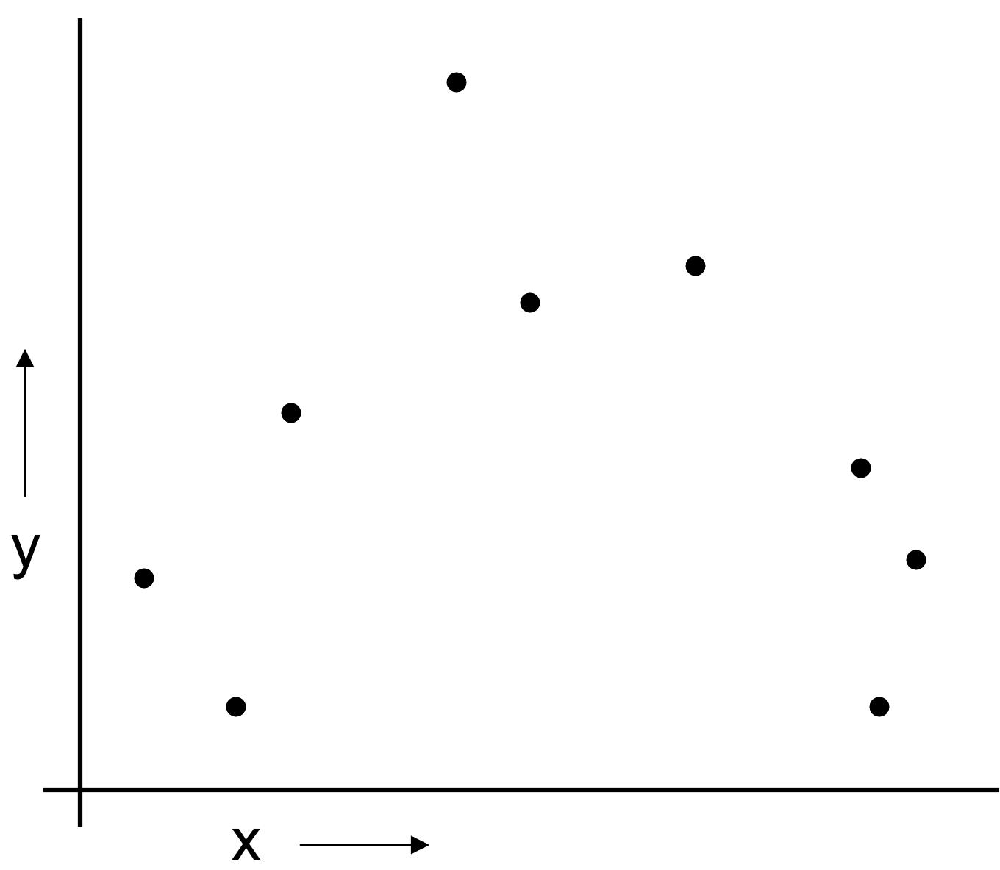


## Три варианта

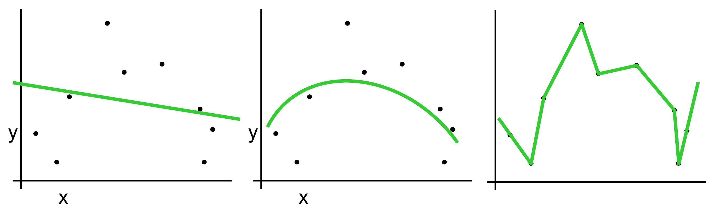

## Метод тестового множества

Случайным образом выберем 30% всех наблюдений и назовем их **тестовой 
выборкой**.

Остальные 70% наблюдений назовем **обучающей выборкой**.

* Обучающая выборка (training set) — имеющиеся наблюдения (образцы).
* Тестовая выборка (test set) — будущие наблюдения.

По наблюдениям из обучающей выборки построим модель.

Проверим модель на тестовой выборке.

## Обучающая и тестовая выборки

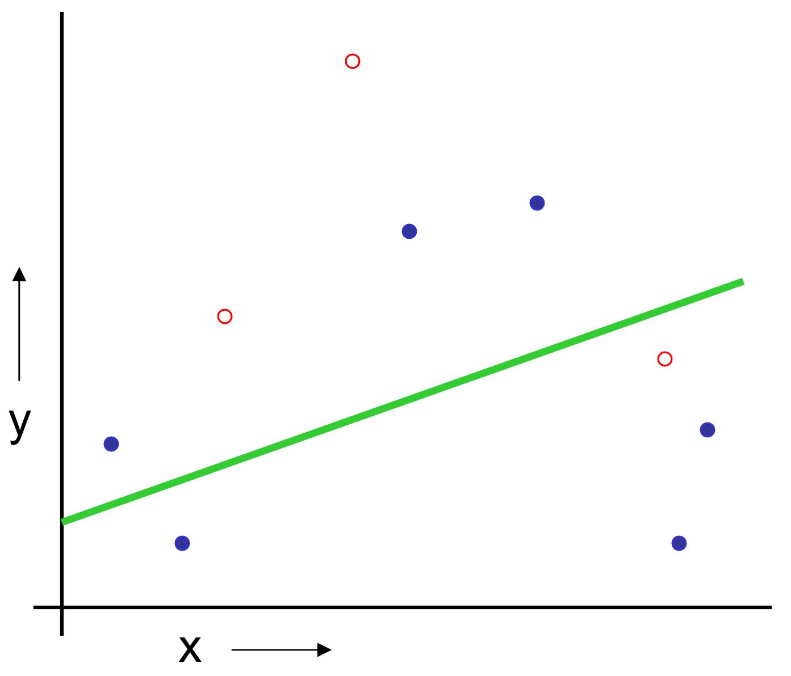

## Проверка подгонки на тестовой выборке

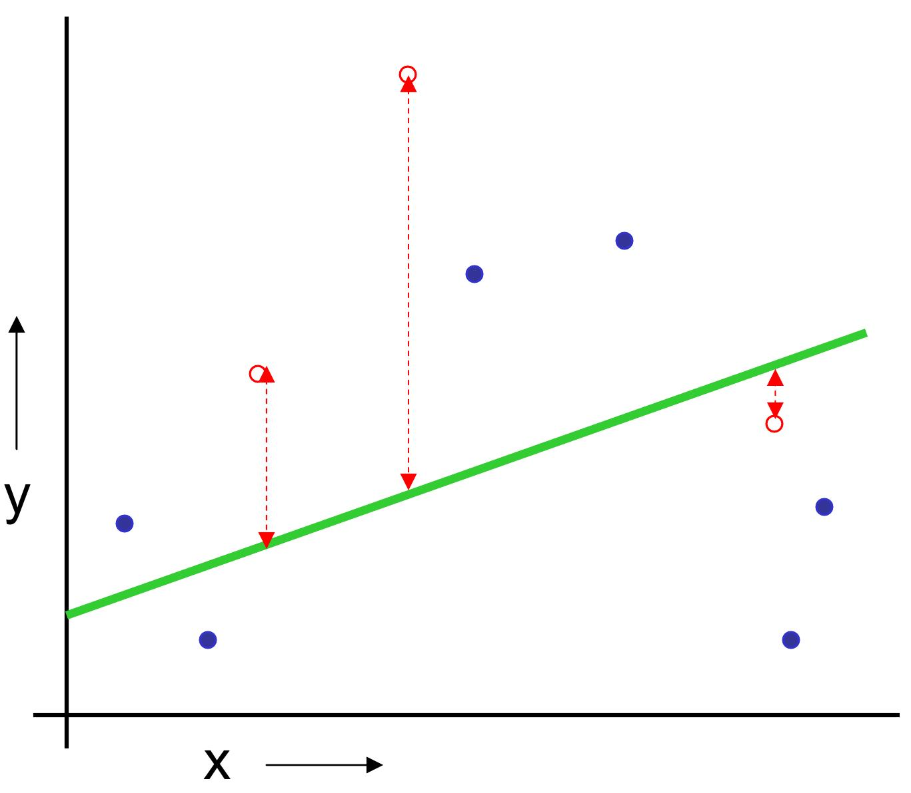

##

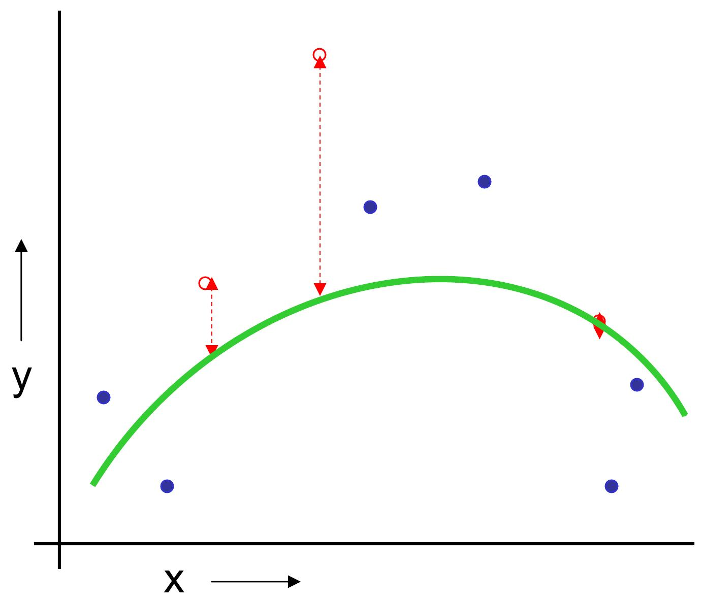

##

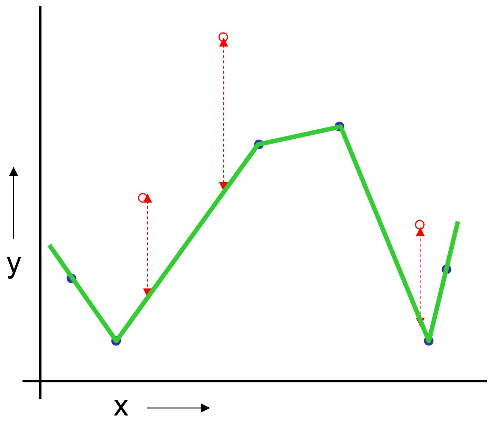

## Обсуждение метода тестового множества

### Достоинства

* Понятен.
* Очень просто реализуется;

### Недостатки

* Расточителен: при построении модели отбрасывается 30% данных
* Если данных мало, то как распределятся точки между обучающей и тестовой 
выборками? Дело случая. А это влияет на результат оценивания качества метода.

Другими словами: оценка качества модели с помощью тестового множества имеет большую дисперсию

## Проверка посредством исключенных наблюдений (leave-one-out cross validation, LOOCV)

Пусть у нас имеется n точек (наблюдений).

* Предыдущую процедуру выполняем n раз.
* Но: тестовое множество теперь состоит из одной точки, каждый раз новой (обучающее множество состоит из оставшихся n-1 точек). 
* За n шагов перебираем все точки множества. Каждый раз подсчитываем значение квадрата ошибки на тестовом наблюдении.
* Посчитаем среднее значение квадратов ошибок по всем n проверкам. Оно и даст нам оценку качества подгонки.

## Линейная регрессия

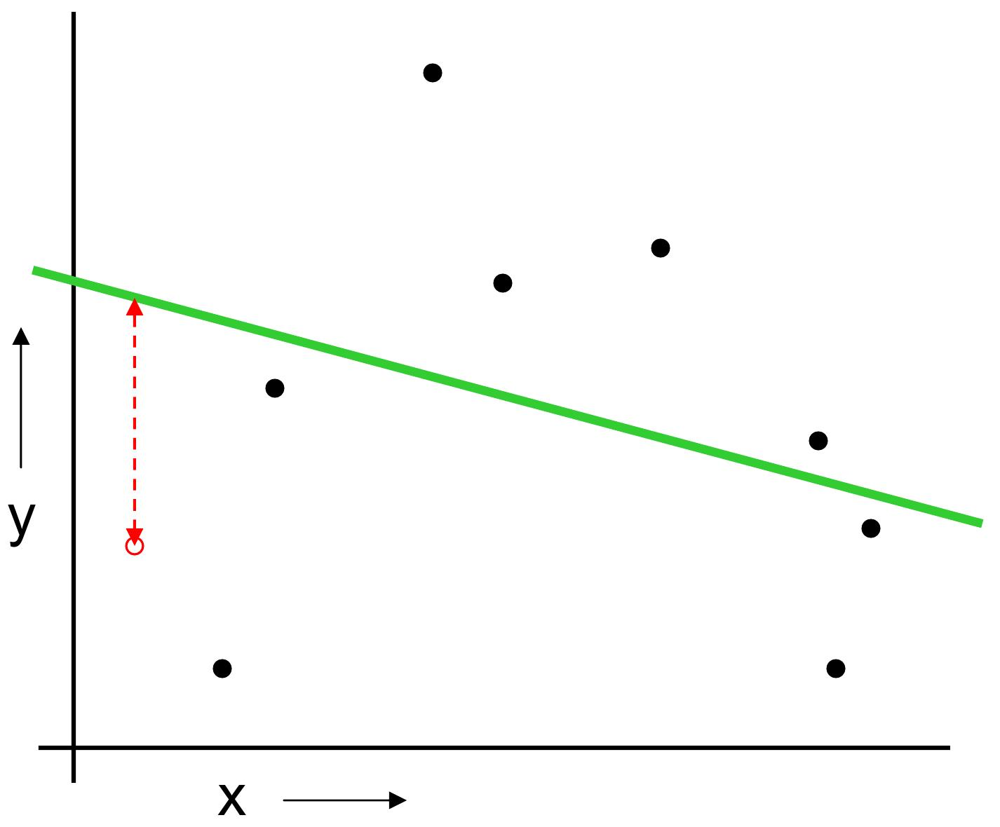

##

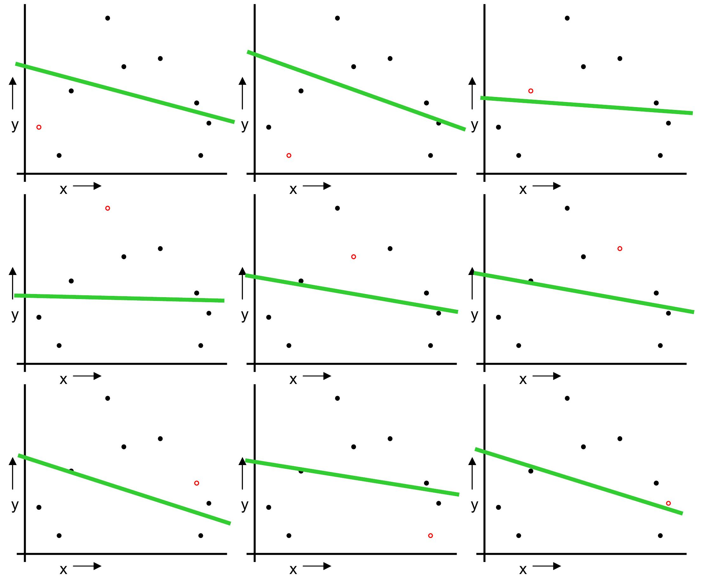

## Средние значения квадратов ошибок

* Для линейной регрессии: MSE = 2.12
* Для квадратичной регрессии: MSE = 0.962
* Для линии, проведенной по точкам: MSE = 3.33

## Сравнение методов

Метод исключенного наблюдения не расходует много данных.

Но: он требует больше вычислений.

Можно ли как-то объединить достоинства методов, сократив расходы на вычисления и более экономно расходуя имеющиеся данные?

## k-кратная кросс-валидация (k-fold cross-validation)

Случайным образом разобьем выборку на k одинаковых частей. В рассматриваемом примере k=3. 

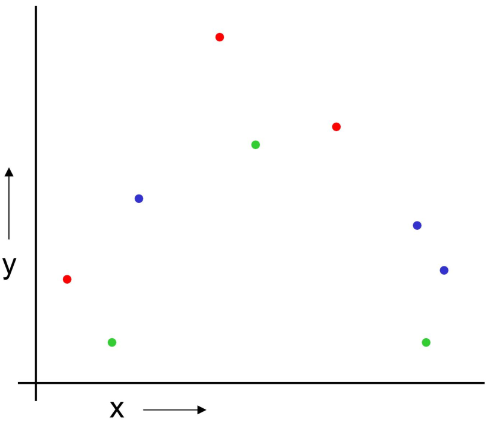

## Алгоритм

* Первая часть наблюдений (из k частей) — тестовая выборка.
* Все остальные наблюдения — обучающая выборка.
* Сосчитаем сумму квадратов ошибок для точек из тестового множества.

## Линейная регрессия

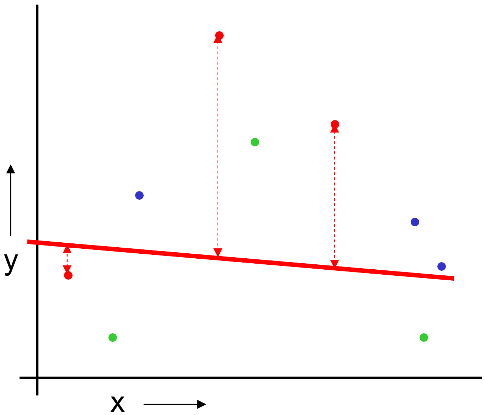

## Определяем обучающую выборку и тестовую выборку заново

* Вторая часть – тестовая выборка.
* Все остальные наблюдения – обучающая 
выборка.
* Сосчитаем сумму квадратов ошибок для точек из тестового множества.

и т. д.

##

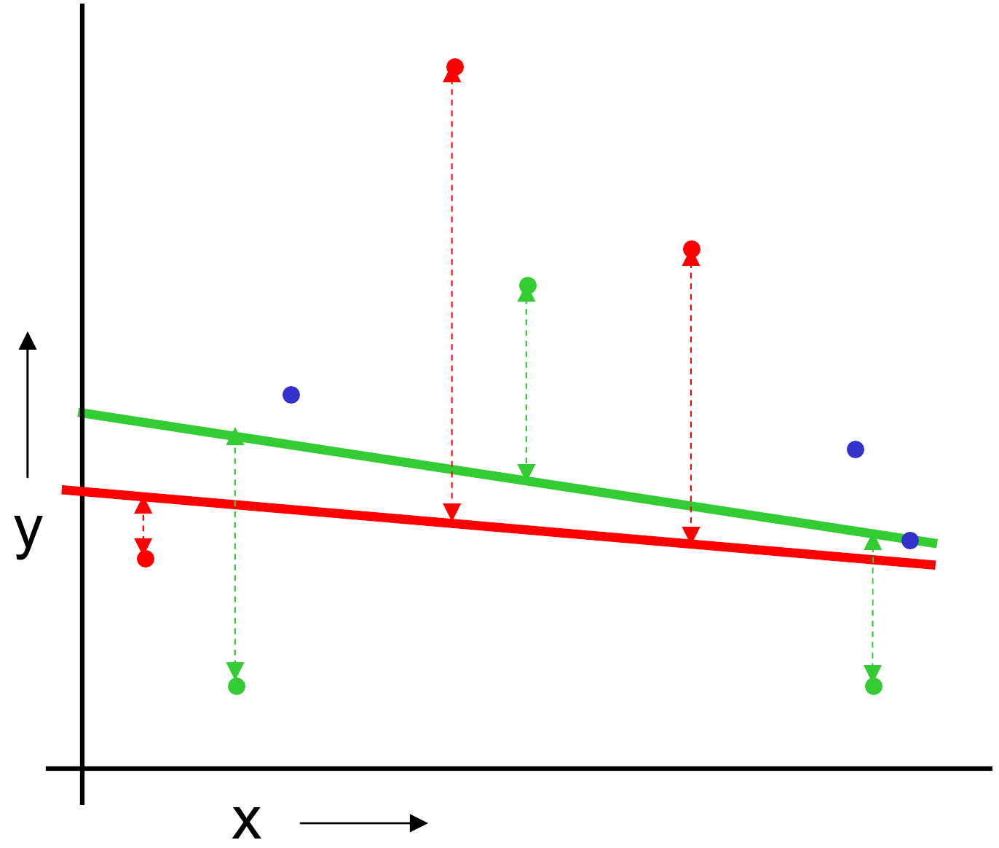

## Осталось сосчитать среднее значение квадратов ошибок

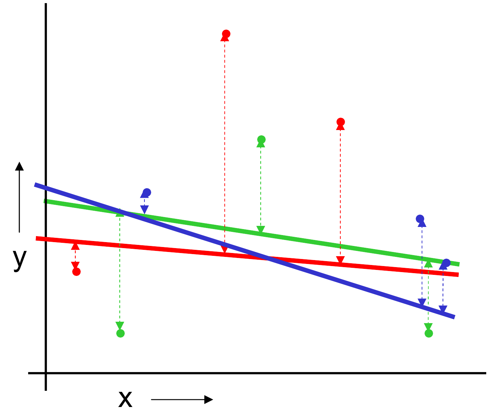

## Сравним результаты k-кратной кросс-валидации

* Для линейной регрессии: MSE = 2.05
* Для квадратичной регрессии: MSE = 1.11
* Для линии, проведенной по точкам: MSE = 2.93

## Выбор метода кросс-валидации

* **3-кратная кросс-валидация:** чуть более экономна, чем метод тестового множества; требует немного больше вычислений.
* **10-кратная кросс-валидация:** исключает из обучения 10% данных, чем метод тестового множества; требует в 10 раз больше вычислений чем метод тестового множества, но меньше чем метод исключенного наблюдения.
* **n-кратная кросс-валидация:** совпадает с методом исключенного наблюдения (LOOCV).

Обычно выбираемые методы лежат в диапазоне от 10-кратной кросс-валидации до метода исключенного наблюдения.

## Так как же выбрать значение k в методе kNN?

1. Вычислим методом LOOCV среднюю ошибку для моделей с разным значеним k
2. Выберем модель, давшую наименьшую ошибку, обучим ее на всем наборе данных и будем использовать для прогнозов.

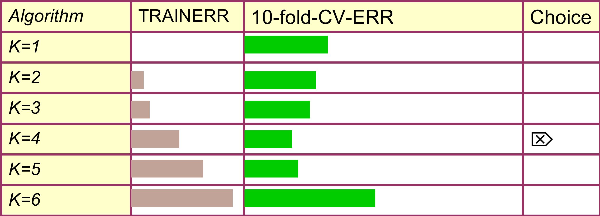


## Ссылки

* Поршнев С. В. Компьютерное моделирование физических процессов в пакете MATLAB. 2-е изд., испр. СПб.: Издательство «Лань», 2011. 736 с.
* Примеры по кросс-валидации заимствованы из "Cross-validation for detecting and preventing overfitting" Andrew W. Moore (www.cs.cmu.edu/~awm)

