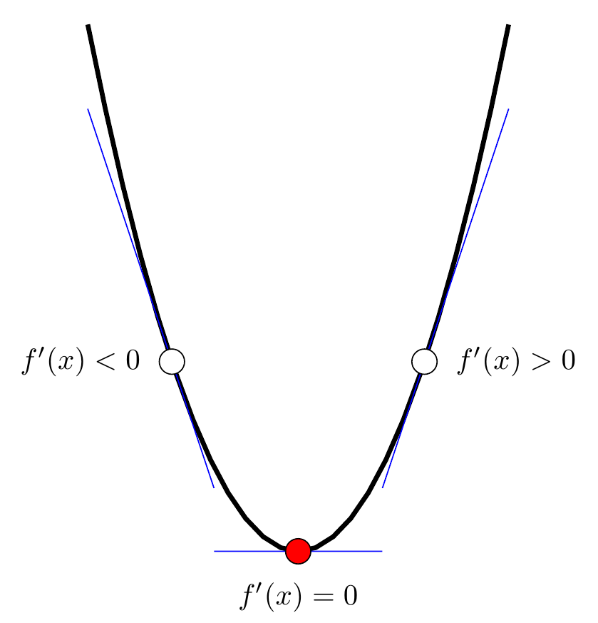
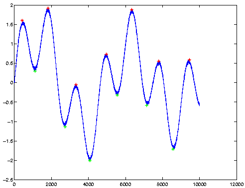
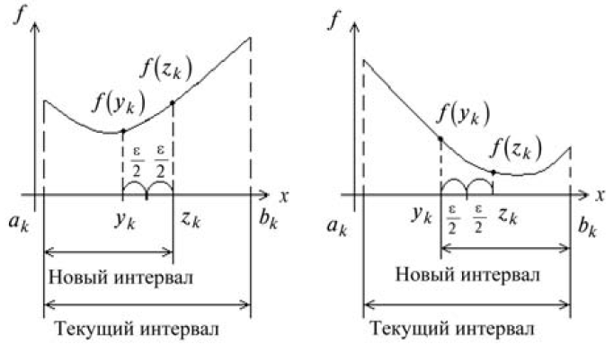
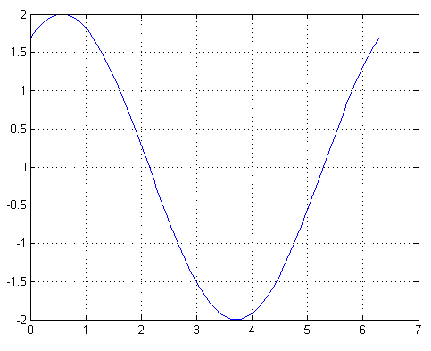

# 1. В поисках постановки задачи

## 

**Оптимизация** — процесс выбора наилучшего варианта из возможных.

Наилучший вариант — тот, что приносит максимальную прибыль или минимизирует потери.


## Как измерить качество результата?

**Метрика** или **критерий качества** — некоторая функция от параметров системы.

От чего зависит урожай? Как оценить его результаты?

Неочевидность выбора критерия.

Если критерий качества один, задача называется **однокритериальной**. Если критериев несколько, то многокритериальной. Мы такие рассматривать не будем.


## Математическая постановка задачи оптимизации

Целевая функция — математическая запись критерия качества. Наилучшие результаты достигаются тогда, когда эта функция имеет экстремум: максимум или минимум (максимальный урожай, минимальный расход денег,…).
$$
f(x^\ast) = \max_{x\in X} f(x) = -\min_{x\in X} [-f(x)]
$$
\begin{center}
\includegraphics[width=100pt]{images/maxmin.png}
\end{center}

Договоримся в дальнейшем искать только минимумы целевой функции. В таком случае целевую функцию удобно называть **функцией потерь**.


## Число параметров

По числу входных параметров задачи оптимизации можно разделить на одномерные и многомерные.

Пример двумерной задачи оптимизации — функция потерь метода наименьших квадратов
$$
L(a,b) = \sum_{i=1}^n (y_i - f(x_i,a,b))^2
$$


## Резюме

Мы будем заниматься однокритериальной оптимизацией, т. е. искать минимумы функции потерь.

Сегодня мы будем рассматривать одномерную оптимизацию — функция потерь $L(x)$ зависит от одной переменной.


# 2. Воспоминания из МатАна

## Необходимое условие и определение типа экстремума

Функция $y=f(x)$ на промежутке $[a;b]$ может достигать своего наименьшего и наибольшего значений либо в граничных точках отрезка $a$ или $b$, либо в точках минимума и максимума. Если функция дифференцируема на отрезке $[a;b]$, равенство
$$
f'(x) = 0
$$
является необходимым условием экстремума.

Если функция дважды дифференцируема на $[a;b]$, то с помощью второй производной можно определить тип экстремума. Пусть $x^\ast$ — точка, в которой $f'(x^\ast) = 0$. Тогда:

* если $f''(x^\ast) > 0$, то $f(x^\ast)$ — минимум функции;
* если $f''(x^\ast) < 0$, то $f(x^\ast)$ — максимум функции;
* если $f''(x^\ast) = 0$, то ничего о характере экстремума сказать нельзя.


## К определению типа экстремума

$$
f(x^\ast+h) = f(x^\ast) + h\cdot f'(x^\ast) + \frac{h^2}{2}\cdot f''(x^\ast) + \ldots
$$
Пусть $x^\ast$ — экстремум, следовательно $f'(x^\ast)=0$. Тогда

$$
f(x^\ast+h) - f(x^\ast) = \frac{h^2}{2}\cdot f''(x^\ast) + \ldots
$$


## Пример

Найти наименьшее значение функции
$$
y = \frac{x^3}{3} - x^2
$$
на отрезке $[1;3]$.


## Решение

Находим производную
$$
y' = x^2 - 2x
$$

Ищем корни уравнения
$$
x^2 - 2x = 0 \Rightarrow x(x-2) = 0 \Rightarrow x_1 = 0, x_2 = 2
$$
Анализируем корень $x = 2$ и границы интервала $x = 1$, $x=3$. В какой точке достигается экстремум?
$$
y(2) = -\frac{4}{3}, \quad y(1) = -\frac{2}{3}, \quad y(3) = 0.
$$
Минимум со значением $y = -4/3$ достигается в точке $x=2$.
$$
y'' = 2x-2 \Rightarrow y(2) = 4 - 2 > 0.
$$

## Внимание!

Для отыскания точек экстремума необходимо решать уравнение $f'(x)=0$.

Нам удалось решить уравнение непосредственно. На практике используют численные методы решения уравнений. Например, метод Ньютона.


## Когда это не работает

* Если функция не имеет аналитической записи, например, задана программным кодом.
* Если у функции нет необходимых производных.
* Если сама функция и/или ее производные имеют сложную запись.

Когда функция потерь может быть вычислена в некоторых дискретных значениях аргумента используются **методы поиска**. Они основаны на вычислении функции потерь в отдельных точках и выборе среди них наименьшего значения. 


# 3. Методы поиска

## Унимодальность

Все численные методы поиска предполагают, что функция потерь унимодальна, т.е. на отрезке $[a;b]$ она имеет только один минимум. 




## Область унимодальности



## Метод перебора

Интервал, внутри которого находится искомый минимум — **интервал неопределенности**.

Наиболее простой способ сузить интервал неопределенности — разбить его на равные части и вычислить функцию потерь в точках разбиения.

Среди вычисленных значений нужно найти минимум. В этом поможет MATLAB-функция `min(x)`. 

Рассмотрим прошлый пример

```
x = linspace(1,3,200)
y = x.^3/3-x.^2;   % не забываем про точки в операциях
[ymin,i] = min(y); % неизвестно, как она устроена!
x(i)
```

Этот метод называется **методом перебора**. Его основное и пожалуй единственное (в одномерном случае) достоинство — простота.


## Интервал неопределенности

В начале интервал неопределенности был равен $b-a = 3-1 = 2$.

Нам потребовалась 200 точек разбиения. В итоге, интервал неопределенности сократился до $\approx 0.01$.

Нужен более эффективный, а главное целенаправленный способ сокращения интервала неопределенности. 


## Метод дихотомии



## Как изменяется интервал неопределенности?

$$
\frac{b-a}{2} \rightarrow \frac{b-a}{2^2} \rightarrow \ldots \rightarrow \frac{b-a}{2^n}
$$

$n$ | $2^n$
----|---
1	  | 2
2	  | 4
4	  | 16
5	  | 32
6	  | 64
7	  | 128

Чтобы уменьшить интервал неопределенности в 100 раз нам понадобится 100 точек в методе перебора и 14 — в методе деления пополам.


## fminbnd

Поиск минимума функции одной переменной $f(x)$ для фиксированного интервала $[x1, x2]$

```
x = fminbnd(fun,x1,x2)
```

`fun` принимает на вход скаляр х и может быть задана виде:

* дескриптора функции
```
x = fminbnd(@myfun,x0)
# где-то в файле myfun.m:
function f = myfun(x)
f = ... % Вычисляет значение функции в точке x.
```

* анонимной функции
```
fun = @(x) sin(x*x)
x = fminbnd(fun,x0); 
```

* inline-функции
```
x = fminbnd(inline('sin(x*x)'),x0); 
```


## Примеры: поиск минимума в одномерном случае

Найти минимум функции $y=\sin(x)$ на промежутке $[0;2\pi]$:
```
x = fminbnd(@sin,0,2*pi)
    x = 4.7124
```
Значение функции в точке минимума:
```
y = sin(x)
    y = -1.0000 
```

##

Найти минимум функции $y=(x-3)^2-1$ на интервале $[0;5]$.

* Создадим М-файл `myfun.m`
```
function f = myfun(x)
f = (x-3).^2 - 1;
```
* Вызовем функцию оптимизации
```
x = fminbnd(@myfun,0,5)
    x = 3 
```
* Значение в точке минимума:
```
y = f(x)
    y = -1 
```

##

Найти минимум функции $y=2\sin(x)+1$ на промежутке $[0;2\pi]$.

```
y = @(x) 2*sin(x+1);
fminbnd(y,0,2*pi)

    3.7124
```
```
% проверим себя
x = linspace(0,2*pi);
y = 2*sin(x+1);
plot(x,y), grid on
```


##




## Задача

Найти минимум функции $y=5x^2 + 14x - 2$ на отрезке $[-3;0]$:

* аналитическим методом;
* с помощью `fminbnd`.


## Задача

Найти минимум функции $y=x^2-\cos(x)$ на промежутке $[-2;3]$.

Оформить функцию как:

1. анонимную;
2. m-файл.


## Ссылки

* Пантелеев А. В., Летова Т. А. Методы оптимизации в примерах и задачах. — 4-е изд., испр. — СПб.: Издательство «Лань», 2015.
