# 1. Многомерный поиск: цель прежняя, проблемы новые

## Минимум функции многих переменных

$$
\mathbf{x} = [x_1, x_2, \ldots, x_n]
$$

Минимум дифференцируемой функции многих переменных $y=f(\mathbf{x})$ можно найти, исследуя ее значения в критических точках, которые определяются из решения системы уравнений
$$
\begin{array}{lll}
\frac{\partial f}{\partial x_1} &=& 0, \\
\frac{\partial f}{\partial x_2} &=& 0, \\
 & \ldots &  \\
\frac{\partial f}{\partial x_n} &=& 0. \\
\end{array}
$$
Решение одной задачи сводится к решению другой, вообще говоря, не менее сложной.


## Проблемы многомерного поиска по сравнению с одномерным

1. Гораздо меньшая вероятность, столкнуться с унимодальной функцией. Сложность проверки унимодальности.
2. Невозможность простого переноса на многомерный случай методов, разработанных для одномерного случая (например, методов дихотомии и "золотого сечения"). Нужны новые численные методы.
3. «Проклятие размерности»: экспоненциальный рост объема вычислений с увеличением размерности задачи.

Рассмотрим область неопределенности $[0;1]^n$:

* $n=1$ — разбивая пополам, получим половину области: $0.5$.
* $n=2$ — разбивая отрезки изменения переменных пополам, получим площадь $0.5 \cdot 0.5=0.25$. 
* $n=3$ — получим $0.5^3$ от объема. 
* $n=5$ — $0.5^5 \approx 3\%$ от размера исходной области.


## Детерминированные алгоритмы минимизации

$$
\argmin_{\mathbf{x}\in X} f(\mathbf{x}) - ?
$$

Классы алгоритмов в зависимости от используемой информации о целевой функции и ее производных: 

* Если на каждой итерации используются лишь значения целевой функции $f(\mathbf{x})$, то это **метод 0-го порядка**. 
* Если, кроме того, требуется вычисление $f'(\mathbf{x})$, то это **метод 1-го порядка**.
* Если нужно также вычислять $f''(\mathbf{x})$, то мы имеем дело с **методом 2-го порядка**.


## Приближенное вычисление производных

$$
\nabla f(x) = \frac{d f}{d x} \approx \frac{f(x+h)-f(x)}{h} ,
$$
$$
\nabla^2 f(x) = \frac{d \nabla f}{d x} \approx \frac{\nabla f(x+h)- \nabla f(x)}{h} .
$$

С вычислением 2-ой производной могут быть проблемы!


## Методы 2-го порядка: метод Ньютона

Пусть необходимо вычислить критические точки внутри отрезка $[a;b]$, то есть решить уравнение
$$
f'(x) = 0 .
$$
Найдем корень этого уравнения $x^\ast$ методом Ньютона. 

Пусть $x^n$ — значение n-го приближения к корню. Очередное приближение к корню вычисляется по формуле
$$
x^{n+1} = x^n - \frac{f'(x^n)}{f''(x^n)}
$$

Метод требует больших расходов памяти по сравнению с методами 0-го и 1-го порядков, но зато он весьма быстро сходится.

Метод Ньютона удобно применять как составную часть гибридного метода поиска: искать окрестность минимума каким-то другим методом, а уже в самой окрестности применить метод Ньютона, который сходится с высокой скоростью.


# 2. Многоликий градиентный спуск (gradient descent)

## Одномерный случай

\bcols

\column{.4\textwidth}

\footnotesize

* Ищем минимум функции $y = f(x)$.
* Известно начальное значение $x = x_0$. Нужно задать направление поиска и величину шага.
* Направления: $\uparrow\uparrow OX$ или $\uparrow\downarrow OX$.
* Шаг: $f'(x)$

\column{.59\textwidth}

```{r,echo=FALSE}
op <- par(cex=1.8)

x <- seq(-4,4,.1)
y <- x^2
plot(x, y, type="l", ylab="y")
text(0,15,"y = x^2")

points(-2,4)
text(-1.3,4.2,"x = x0")
arrows(-3,-4-4*(-3),-1,-4-4*(-1), lty=2, length=.1, code=1)
text(-2.7,3,"y'(-2) =-4")

points(2,4)
arrows(3,-4+4*(3),1,-4+4*(1), lty=2, length=.1, code=1)
text(2.7,3,"y'(2) = 4")

par(op)
```

\ecols

Новая точка вычисляется по формуле
$$
x_1 \leftarrow x_0 - \lambda f^\prime (x_0) 
$$
$\lambda$ служит для контроля длины шага. Оно должно обеспечивать выполнение условия: $f(x_{i+1}) \leq f(x_i)$.


## Многомерный случай

Вектор градиента
$$
\nabla f(\mathbf{x}) = \frac{\partial f}{\partial x_1} \mathbf{e}_1 + 
\frac{\partial f}{\partial x_2} \mathbf{e}_2 + \ldots + \frac{\partial f}{\partial x_n} \mathbf{e}_n
$$
указывает направление *скорейшего подъема* функции. 

Для поиска минимума функции $\mathbf{y} = f(\mathbf{x})$ надо двигаться в противоположном направлении
$$
\mathbf{x}_{i+1} \leftarrow \mathbf{x}_i - \lambda \nabla f (\mathbf{x}_i)
$$
\begin{center}
\includegraphics[width=100pt]{images/Gradient_descent.png}
\end{center}


## Пример 1: $y = x_0^2 + x_1^2$ — все просто!

```
fun = @(x0,x1) x0^2 + x1^2;

lambda = 0.01;           %  можно подобрать лучше !!!
x0 = 15;
x1 = -9;

y = fun(x0,x1);

for i=1:100
  x0 = x0 - lambda * 2*x0;
  x1 = x1 - lambda * 2*x1;

  y = [y, fun(x0,x1)];   %  неэффективно !!!
end
```

## График к примеру 1

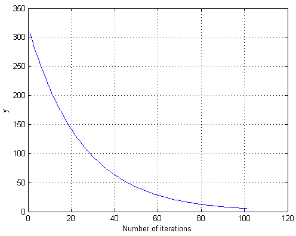


## Пример 2: $y = x_0^2\sin(x_1) + x_1^2\exp(x_0)$

```
fun = @(x0,x1) x0^2*sin(x1) + x1^2*exp(x0);

lambda = 0.001;
x0 =  8;
x1 = -9;

y = fun(x0,x1);

for i = 2:300
  x0 = x0 - lambda * (2*x0*sin(x1) + x1^2*exp(x0));
  x1 = x1 - lambda * (x0^2*cos(x1) +2*x1*exp(x0));
  
  y = [y, fun(x0,x1)];
end
```

## График к примеру 2

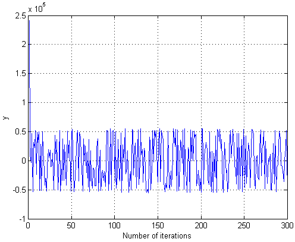


## Что происходит?

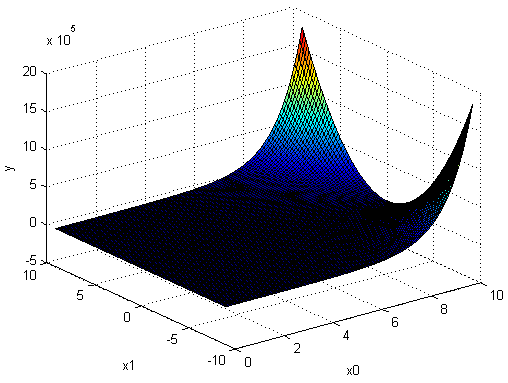


## Пример 3.

Найти минимум функции методом градиентного спуска
$$
f(x,y) = (x-5)^2 + (y-8)^2 .
$$


## Решение

```
f = @(x,y) (x-5)^2 + (y-8)^4;

n = 30;

x = zeros(1,n);
y = zeros(1,n);
z = zeros(1,n);

lambda = 0.1;

x(1) = 0; y(1) = 0; z(1) = f(x(1),y(1));

for i=2:n
  x(i) = x(i-1) - lambda * 2 * (x(i-1)-5);
  y(i) = y(i-1) - lambda * 2 * (y(i-1)-8);
  z(i) = f(x(i),y(i));
end
```

## График

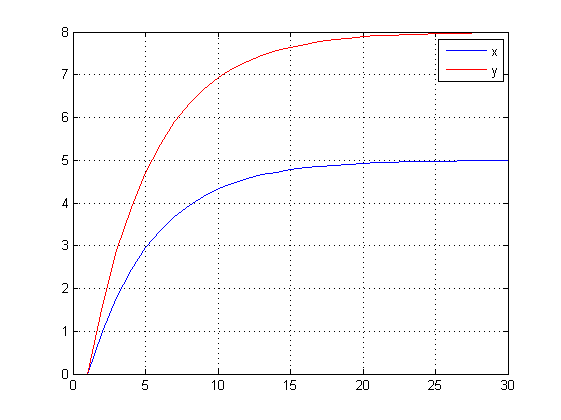


## Параметр $\lambda_i$ выбирается...

* постоянным, в этом случае метод может расходиться;
* дробным шагом: длина шага в процессе спуска делится на некое число;
* наискорейшим спуском: $\lambda_i = \argmin_\lambda f({\mathbf{x}}_{i+1})
 = \argmin_{\lambda }\,f({\mathbf{x}}_i-\lambda \nabla f({\mathbf{x}}_{i}))$.


## Импульсная добавка

Базовый метод:
$$
\mathbf{x}^{n+1} = \mathbf{x}^{n} - \lambda \left. \frac{\partial f}{\partial x_i} \right|_{\mathbf{x}^{n}}
$$
$\lambda$ — параметр обучения (learning rate) (между 0 и 1).

Использование "импульсной" добавки позволяет ускорить движение метода по пологой поверхности :
$$
\mathbf{x}^{n+1} = \mathbf{x}^{n} - \lambda \left. \frac{\partial f}{\partial x_i} \right|_{\mathbf{x}^{n}} + \beta (\mathbf{x}^{n} - \mathbf{x}^{n-1})
$$
$\beta$ — "импульс" (между 0 и 1).


## Разновидности градиентного спуска

\bcols

\column{.5\textwidth}

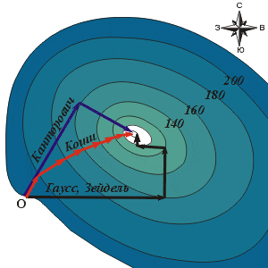

\column{.5\textwidth}

\small

* **Коши** (метод скорейшего спуска) — движение уменьшающимися шагами в направлении антиградиента.
* **Гаусс-Зейдель** — двигаться по одной переменной пока уровень понижается, затем перейти на следующую переменную (каждый раз решаем одномерную задачу).
* **Канторович** — двигаться в направлении антиградиента до тех пор, пока уровень понижается, затем вычислить новое направление антиградиента (меньше вычислений).

\ecols


## Проблема оврагов

\bcols

\column{.5\textwidth}

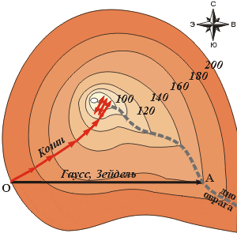

\column{.5\textwidth}

* **Гаусс-Зейдель** — может двигаться только вдоль одной из осей координат. В овраге он застревает.
* **Коши** — оказавшись на краю оврага, он движется в направлении самого крутого спуска, и оно приведет его в точку по другую сторону оврага. Из этой точки он вернется на прежнюю сторону и т.д. Даже если с уменьшением шага минимум и будет достигнут, то очень медленно.

\ecols


## Методы овражного поиска

\bcols

\column{.5\textwidth}

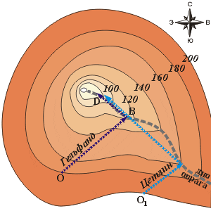

\column{.5\textwidth}

**Гельфанд-Цетлин** — движение из двух точек. Оказавшись (по Канторовичу) на краю оврага, определяют направление оврага и идут вдоль него от более высокой точки к более низкой.

\ecols


# 3. Методы 0-го порядка (прямые методы поиска)

## Симплексный метод

Симплекс (лат. *simplex* — простой) — простейший выпуклый многогранник данного числа измерений $n$. 
* 0-мерный симплекс — точка.
* 1-мерный симплекс — отрезок.
* 2-мерный симплекс — треугольник. 
* 3-мерный — тетраэдр (пирамида).

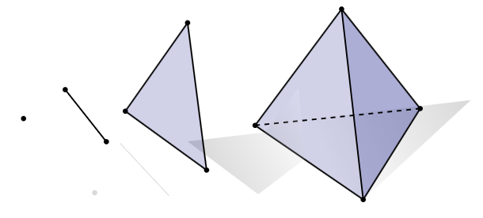


## Начальный этап

Зададимся значением точности $\varepsilon$.

Выберем начальную точку $\mathbf{x}_0$ и построим на ее основе исходный симплекс. Две недостающие точки можно построить «отступая» некоторое расстояние по каждой из координат.


## Основной этап 1

**1.** Вычислим значения $f(\mathbf{x_k})$ в вершинах треугольника $\mathbf{x_k}$, $k=0,1,2$.

**2.** Упорядочим вершины симплекса так, чтобы
$f(\mathbf{x_0}) \leq f(\mathbf{x_1}) \leq f(\mathbf{x_2})$.

**3.** Проверим выполнения условия остановки
\begin{equation}
\frac{1}{n} \sum_{k=1}^n [f(\mathbf{x_k})-f(\mathbf{x_0})]^2 < \varepsilon^2 .
\label{stop}
\end{equation}

Выполнение этого условия означает, что: либо 1) наш симплекс (треугольник) стал мал настолько, что значения функции в его вершинах мало отличаются, либо 2) внутрь симплекса попала точка минимума $\mathbf{x}^\ast$; 3) произошло и то и другое одновременно.

Если условие \ref{stop} выполнено, то вычисления следует прекратить, полагая $\mathbf{x}^\ast = \mathbf{x}_0$. В противном случае перейти к шагу 4.


## Основной этап 2

**4.** Найдем среднее значение координат всех вершин треугольника $\mathbf{x}_c$ за исключением $\mathbf{x}_n$, в которой получено наибольшее значение функции
$$
\mathbf{x}_c = \frac{1}{n}\sum_{k=0}^{n-1} \mathbf{x}_k .
$$
и выполним отражение вершины $\mathbf{x}_n$ относительно $\mathbf{x}_c$:
\begin{equation}
\mathbf{y} = 2 \mathbf{x}_c - \mathbf{x}_n .
\label{reflection}
\end{equation}

Формула \ref{reflection} следует из очевидного равенства:
$$
\mathbf{x}_c = \frac{\mathbf{y}+\mathbf{x}_n}{2} .
$$

## 

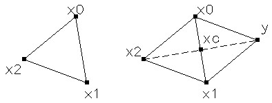

Если $f(\mathbf{y}) < f(\mathbf{x}_n)$, то положим $\mathbf{x}_n = \mathbf{y}$ и вернемся к шагу 2. Иначе — перейдем к шагу 5.

## Основной этап 3 

**5.** Перейдем к новому симплексу с вдвое меньшим ребром, считая базовой вершиной $\mathbf{x}_0$. Остальные вершины симплекса строим по формуле
$$
\mathbf{x}_i = \frac{\mathbf{x}_i+\mathbf{x}_0}{2}, \quad i=1,2
$$

Перейдем к шагу 1.

Операция отражения стала способом «производства» новых точек. Естественно, его можно усовершенствовать.

Так в 1965 г. британцы Нелдер и Мид предложили свой метод, добавив к отражению при построении нового симплекса операции сжатия и растяжения. Так появился **метод Нелдера-Мида**.


# 4. Функции Matlab

## Пакеты Matlab (R2017b)

* fminsearch
* [Optimization Toolbox](https://www.mathworks.com/products/optimization.html) — методы поиска локального минимума.
* [Global Optimization Toolbox](https://www.mathworks.com/products/global-optimization.html) — методы поиска глобального минимума.


## fminsearch — поиск минимума функции нескольких переменных методом Нелдера-Мида

```
[x,fval] = fminsearch(fun,x0,options)
```

*	`fun` — функция, минимум которой мы ищем. Записывается в виде m-функции или анонимной функции;
*	`x0` — вектор координат начальной точки поиска;
*	`options` — настройки функции (*необязательный параметр*);
*	`x` — координаты минимума функции `fun` (вектор той же размерности, что и `x0`);
*	`fval` — значение целевой функции в точке минимума `x`.


## Пример 1.

Найти минимум функции $f = \sin x \cos y + 3$ в окрестности точки $[2,-2]$.

1. Создадим m-функцию `myfun`. В файле `myfun.m` запишем
```
function f = myfun(x)
f = sin(x(1))*cos(x(2)) + 3;
```

2. Вызовем `fminsearch()`, в которую передадим `myfun` и координаты точки, близи которой искать минимум — `[2,-2]`:
```
x = fminsearch(@myfun,[2,-2])
```

Получим
```
x =
    1.5708   -3.1416
```

## Пример 2.

Найти минимум функции $f(x, y)=(x-1)^2+(y-2)^2$.

```
f = @(x) (x(1)-1).^2+(x(2)-2).^2;
[xmin, fmin] = fminsearch(f, [0 0]);
```

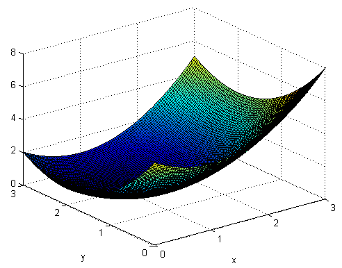


## Задача 1.

\Large

Найти минимум функции
$$
f(x,y)=(1-x)^2+100(y-x^2)^2
$$

<!-- Минимум функции Розенброка: (1,1) -->


## Задача 2.

Найти минимум функции (функция Растригина)
$$
f(x,y) =20+x^2+y^2-10(\cos 2\pi x + \cos 2\pi y)
$$

## 3D график

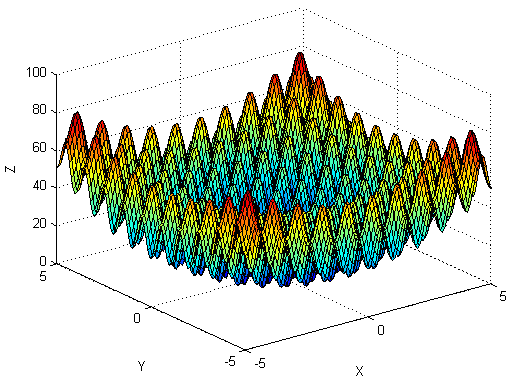

## Контуры

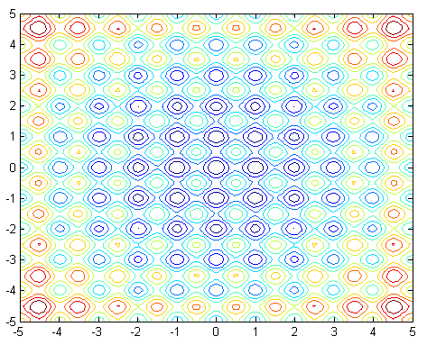


# 5. От локального к глобальному: мультистарт

## Локальный и глобальный экстремумы

**Локальный минимум** — точка, в которой целевая функция имеет наименьшее значение среди всех всех соседних точек.

**Глобальный минимум** — точка, где достигается наименьшее значение целевой функции во всей области поиска. Глобальный минимум — наименьшей среди всех локальных.

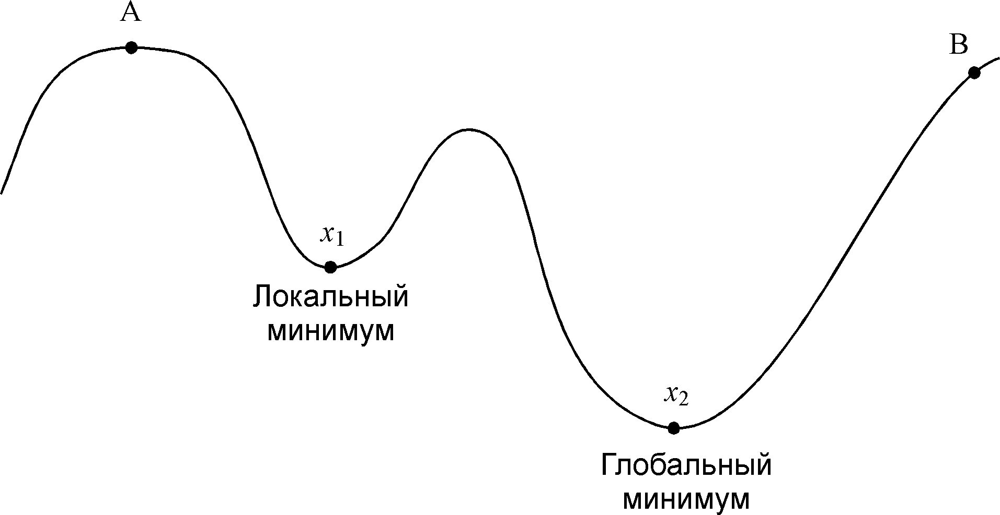


## Замечания идеологического характера

Мы ищем только локальные минимумы. Имеющиеся в нашем распоряжении функции находят ближайший локальный минимум и на этом поиск прекращается.

Найдя локальный минимум, мы не можем доказать что это точно локальный минимум.

Как же в таком случае искать глобальный минимум?


## Мультистарт

Мультистарт предполагает запуск локальных методов поиска минимума из различных точек области поиска. Затем среди всех найденных локальных минимумов выбирается наименьшее значение.

1. Мы можем разделить область поиска сеткой. В узлах сетки будем вычислять начальные приближения для какого-нибудь метода локального поиска.
2. Случайный мультистарт: координаты начальных точек выбираются в области поиска случайным образом.

**Мы не можем быть уверены, что нашли глобальный минимум, и должны удовлетвориться лучшим из минимумов локальных**.


## Примитивная реализация мультистарта

```
n = 10; % число попыток
fval = zeros(n,1); % здесь будут храниться значения функции 
xmin = zeros(n,2); % здесь будут храниться минимумы
for i = 1:n
    % случайным образом задаем начальную точку
    x = -pi+2*pi*rand;
    y = -pi+2*pi*rand; 
    x0 = [x,y];
    % находим локальный минимум
    [xmin(i,:),fval(i)] = fminsearch(@fun,x0);
end
% поиск наименьшего среди всех найденных минимумов
[fv,i] = min(fval);
xmin(i,:) % координаты точки глобального минимума
fval(i)   % значение функции в точке глобального минимума
```


## Ссылки

* http://www.ega-math.narod.ru/Quant/Tmeladze.htm — иллюстрации к классическим методам оптимизации взяты из статьи З. Я. Тьмеладзе "Нелинейное программирование" (Квант, № 1, 1976).

