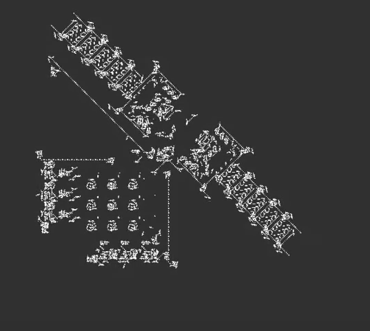

# 1. Уравнение диффузии

## Диффузия


**Диффузия** — процесс переноса вещества из области с высокой концентрацией в область с низкой концентрацией

## Концентрация — количество вещества

\begin{center}
\includegraphics[width=155pt]{images/diffusion01.png}

\tiny $t_1 < t_2 < t_3 < t_3$
\end{center}

\small

**Концентрация примеси** является функцией места и времени, 
$$
u = u(x,t)
$$
если

* температура вещества постоянна
* в среде нет особых, энергетически более выгодных областей

## Поток

**Поток вещества** через сечение трубы — количество примеси, проходящее через сечение в единицу времени.

\begin{center}
\includegraphics[width=155pt]{images/diffusion02.png}
\end{center}

Поток будет тем больше, чем больше перепад концентраций примеси в сечении:

$$
\Phi \sim \frac{u(x+\Delta x,t) - u(x,t)}{u(x,t)} \approx -\frac{\partial u}{\partial x}
$$

## Плотность потока

Поток пропорционален площади сечения $S$ и зависит от свойств вещества $D$

$$
\Phi = - DS \frac{\partial u}{\partial x}
$$
$D$ — коэффициент диффузии. Характеризует диффузионные свойства вещества.

Чтобы избавится от привязки к конкретному сечению, используют понятие **плотности потока вещества** — количества вещества, проходящего в единицу времени через единицу площади сечения

$$
\varphi = - D \frac{\partial u}{\partial x}
$$

## Изменение концентрации со временем

Выделим в трубе элементарный объем и потоки примеси, входящий и выходящий из этого объема.

\begin{center}
\includegraphics[width=155pt]{images/stream.png}
\end{center}

По закону сохранения материи разность этих потоков равна изменению концентрации внутри данного объема, происходящему с течением времени 
$$
(u_1-u_2)S\Delta x = (\varphi_2 - \varphi_1) S \Delta t
$$
$$
\Delta u \Delta x = -\Delta \varphi \Delta t
$$

## Уравнение диффузии

$$
\Delta u \partial x = -\Delta \varphi \partial t
$$
$$
\frac{\partial u}{\partial t} = -\frac{\partial \varphi}{\partial x}
$$

Вспомним определение потока вещества и получим
$$
\frac{\partial u}{\partial t} = \frac{\partial }{\partial x} \left(D\frac{\partial u}{\partial x}\right)
$$
$D$, вообще говоря, является функцией концентрации, т.к. частота обмена местами атома зависит от структуры окружающего этот атом участка вещества. Но если считать $D \sim const$, то получим **уравнение диффузии**
$$
\frac{\partial u(x,t)}{\partial t} = D\frac{\partial^2 u(x,t)}{\partial x^2}
$$

## Краевые условия

Кроме самого уравнения

$$
\frac{\partial u(x,t)}{\partial t} = D\frac{\partial^2 u(x,t)}{\partial x^2}
$$

необходимо задать также

* начальное условие
$$
u(x,0) = f(x)
$$

* граничные условия
$$
u(a,t) = u_a, \quad u(b,t) = u_b
$$

## Что дальше?


# 2. Метод конечных разностей

## Дискретизация

\scriptsize
Заменим непрерывную функцию $u(x,t)$ функцией, заданной в дискретные моменты времени
$$
0, \Delta t, 2\Delta t, \ldots , N\Delta t = T
$$
в дискретных точках пространства
$$
a, a + \Delta x, a +2\Delta x, \ldots , a +J\Delta x = b
$$
\normalsize
$$
u(x,t) \rightarrow u(a+j\Delta x, n\Delta t)
$$
\begin{center}
\includegraphics[width=150pt]{images/grid.png}
\end{center}

## Продолжим превращения

Заменим в уравнении диффузии производные их приближенными значениями:

$$
\frac{\partial u}{\partial t} \approx \frac{u_j^{n+1}-u_j^n}{\Delta t}
$$
$$
\frac{\partial u_{j+1}}{\partial x} \approx \frac{u_{j+1}^n-u_j^n}{\Delta x}, \quad \frac{\partial u_j}{\partial x} \approx \frac{u_j^n-u_{j-1}^n}{\Delta x}
$$
$$
\frac{\partial^2 u}{\partial x^2} \approx \frac{\frac{\partial u_{j+1}}{\partial x} - \frac{\partial u_j}{\partial x}}{\Delta x} = \frac{u_{j+1}^n - 2u_j^n + u_{j-1}^n}{\Delta x^2}
$$

## Разностное уравнение

Вместо исходного уравнения 
$$
\frac{\partial u(x,t)}{\partial t} = D\frac{\partial^2 u(x,t)}{\partial x^2}
$$

получим
$$
\frac{u_j^{n+1}-u_j^n}{\Delta t} = D \frac{u_{j+1}^n - 2u_j^n + u_{j-1}^n}{\Delta x^2}
$$

Если известен профиль концентрации в заданный момент времени, т.е. для определенного момента времени $n$ мы знаем значения все значения $u_j^n$, то мы можем найти концентрацию в следующий момент времени $u_j^{n+1}$   для каждого $j$, т.е. для любой точки пространства (сетки) и тем самым решить уравнение.

## Расчетная формула

Перепишем
$$
\frac{u_j^{n+1}-u_j^n}{\Delta t} = D \frac{u_{j+1}^n - 2u_j^n + u_{j-1}^n}{\Delta x^2}
$$
следующим образом

$$
u_j^{n+1} = u_j^n + \frac{D\Delta t}{\Delta x^2} (u_{j+1}^n - 2u_j^n + u_{j-1}^n)
$$
или
$$
u_j^{n+1} = s(u_{j+1}^n + u_{j-1}^n) + (1-2s)u_j^n, \quad s = D\Delta t / \Delta x^2 .
$$

Т.е. концентрация примеси в данной точке в определенный момент времени определяется концентрацией в этой точке (на $(1-2s)$) и в соседних точках ($s$) в предыдущий момент времени.

## Вспомним сетку


## Код

\scriptsize

```
xmin = -5; xmax = 5; % границы стержнЯ
tmin = 0; tmax = 4;  % интервал времени
J = 10; % число узлов по x
N = 20; % число узлов по t
dx = (xmax-xmin)/J; % шаг разбиениЯ стержнЯ
dt = (tmax-tmin)/N; % шаг по времени

D = 2; % коэф-т диффузии
fmax = 50; % макc. знач-е концентрации
f = zeros(1,J); f( round(J/2) ) = fmax; 
u = zeros(N,J);
u(1,:) = f; % нач. условие
ua = 0; ub = 0; % гран. условиЯ в нач. момент времени

s = D*dt/dx^2;
if 1-2*s < 0, error('s incorrect'), end

for n = 1:N-1
    u(n+1,2:J-1) = s*(u(n,3:J) + u(n,1:J-2)) + (1-2*s)*u(n,2:J-1);
    u(n+1,1) = ua;
    u(n+1,J) = ub;
end
surf(u)
xlabel('x'),ylabel('t'),zlabel('u')
```

## Видео


## Замечания

По физическому смыслу задачи масса распространяющейся примеси должна сохранятся
$$
s+s+(1-2s)=1$$

Кроме того, коэффициенты $s$ и $(1-s)$ должны быть положительны: $s>0$, $(1-2s)>0$, иначе получится, будто примесь движется «вспять во времени».

Но при $N = 10$ имеем $s = 0.8$ и второе неравенство не выполняется. В программу необходимо добавить проверку.


# 3. Клеточные автоматы

## Клеточный автомат, моделирующий диффузию

**Клеточный автомат** представляет собой набор конечного числа элементов (клеток или ячеек), образующих регулярную структуру (сетку). 

Каждая клетка может находиться в одном из конечного числа состояний, например, «0» или «1».

Для клетки вводится понятие окрестности, т.е. клеток, располагающихся не более чем на заданном расстоянии от нее. 

Каждая клетка может взаимодействовать только с клетками из своей окрестности.

\begin{center}
\includegraphics[width=150pt]{images/ca.png}
\end{center}

$$
u_j^{n+1} = s_l u_{j-1}^n + s u_j^n + s_r u_{j+1}^n
$$
$$
s_l + s + s_r = 1 .
$$

## Код

\scriptsize

```
ncells = 10; % количество Ячеек
N = 20; % количество шагов по времени

L = 1/3; % влево
S = 1/3; % на месте
R = 1/3; % вправо

c = zeros(ncells,1); % Массив значений концентрации
cmax = 100;          % Максимум концентрации
c(ncells/2) = cmax;  % Начальное значение концентрации
x = 2:ncells-1;

axis([1 ncells 0 cmax]), grid on
xlabel('Position'), ylabel('Value')

for i=1:N   % цикл по времени
    line(1:ncells,c,'EraseMode','none') % рисуем текущие значениЯ концентрации          
    c(x) = c(x-1)*L + c(x)*S + c(x+1)*R; % считаем новые
    title(['Time Step: ' num2str(i)])
end
```

## Одномерный клеточный автомат


##


## Правило 30


## Правило 30 в действии


## Игра "Жизнь" (Game of Life)

Место действия — размеченная на клетки плоскость.

Каждая клетка может находиться в двух состояниях: быть "живой" или быть "мертвой" (пустой). 

Клетка имеет восемь соседей, окружающих ее.

Игрок задает начальное распределение клеток (первое поколение) и после этого не принимает участия в игре.

Каждое следующее поколение рассчитывается по правилам:

* в пустой клетке, рядом с которой есть ровно три живые клетки, зарождается жизнь;
* если у живой клетки есть две или три живые соседки, то эта клетка продолжает жить; если соседей меньше двух или больше трёх, то клетка умирает ("от одиночества" или "от перенаселённости").

## История

Джон Конвей заинтересовался проблемой, предложенной в 1940-х годах Джоном фон Нейманом: можно ли создать гипотетическую машину, которая способна воспроизводить сама себя. 

Джону фон Нейману удалось создать математическую модель такой машины с очень сложными правилами. 

Конвей попытался упростить эти правила, и, в конце концов, создал правила игры "Жизнь".

Впервые описание этой игры было опубликовано в октябрьском выпуске журнала Scientific American за 1970 год, в рубрике ["Математические игры"](https://life.written.ru/game_of_life_review_by_gardner) Мартина Гарднера.

##



[**Youtube: epic conway's game of life**](https://www.youtube.com/watch?v=C2vgICfQawE)

## Факты и приложения

* **Биология.** Внешнее сходство с развитием популяций примитивных организмов привело к созданию модификаций игры, которые могут с точностью повторять размножение бактерий. 
* **Физика.** Клеточные автоматы вообще и игра "Жизнь" в частности используются для анализа "явлений переноса" — диффузии, вязкости и теплопроводности.
* **Информатика.** В игре "Жизнь" можно создать универсальную машину Тьюринга: таким образом все, что может быть вычислено алгоритмически, может быть вычислено внутри игры "Жизнь".

